# TIA Linter — Benutzerhandbuch

**Version dieses Handbuchs:** 0.18 (Entwurf)
**Stand:** 18.07.2026
**Programmversion:** 0.1.0

> **Hinweis zum Bearbeitungsstand:** Dieses Handbuch ist inhaltlich
> vollständig — alle Kapitel 1–9 (grundsätzliche Funktion und Bedienung der
> Oberfläche) sowie Kapitel 10 mit allen 35 Prüfpunkten (siehe
> [Übersichtstabelle am Anfang von Kapitel 10](#10-die-prüfpunkte-im-detail))
> sind ausgearbeitet. Es trägt weiterhin die Kennzeichnung "Entwurf", bis
> eine erste vollständige Durchsicht stattgefunden hat.
>
> **Bild-Platzhalter:** An über 20 Stellen steht bereits ein
> Bild-Platzhalter (``), der auf einen
> noch zu erstellenden Screenshot bzw. eine Grafik verweist. Details zum
> Ergänzen der Bilder stehen in
> [Anhang B](#anhang-b-aus-diesem-handbuch-ein-pdf-erstellen).

---

<div style="page-break-after: always;"></div>

## Inhaltsverzeichnis

1. [Über dieses Handbuch](#1-über-dieses-handbuch)
2. [Was ist der TIA Linter?](#2-was-ist-der-tia-linter)
3. [Voraussetzungen](#3-voraussetzungen)
4. [Grundprinzip der Prüfung](#4-grundprinzip-der-prüfung)
5. [Installation und Einrichtung](#5-installation-und-einrichtung)
6. [Bedienung der Oberfläche](#6-bedienung-der-oberfläche)
   1. [Programmstart](#61-programmstart)
   2. [Die Eingabeseite](#62-die-eingabeseite)
   3. [Während der Prüfung](#63-während-der-prüfung)
   4. [Die Ergebnisseite](#64-die-ergebnisseite)
   5. [Gemerkte Einstellungen](#65-gemerkte-einstellungen)
7. [Der PDF-Report](#7-der-pdf-report)
8. [Das Pfad-Format der Befunde](#8-das-pfad-format-der-befunde)
9. [Die Protokolldatei (Log-Datei)](#9-die-protokolldatei-log-datei)
10. [Die Prüfpunkte im Detail](#10-die-prüfpunkte-im-detail)

**Anhang**

- [A. Glossar](#anhang-a-glossar)
- [B. Aus diesem Handbuch ein PDF erstellen](#anhang-b-aus-diesem-handbuch-ein-pdf-erstellen)
- [C. Änderungshistorie dieses Handbuchs](#anhang-c-änderungshistorie-dieses-handbuchs)

---

<div style="page-break-after: always;"></div>

## 1. Über dieses Handbuch

Dieses Handbuch richtet sich an alle, die mit dem **TIA Linter** ein
TIA-Portal-Projekt prüfen möchten — unabhängig davon, ob sie das Programm
selbst bedienen oder nur die Ergebnisse (den PDF-Report) lesen und verstehen
wollen. Es setzt keine Programmierkenntnisse voraus.

Der Aufbau folgt bewusst vom Allgemeinen zum Speziellen:

- Die **Kapitel 1–9** erklären, was das Programm tut, wie es aufgebaut ist
  und wie man es bedient — unabhängig davon, welche einzelnen Prüfpunkte
  gerade aktiv sind.
- **Kapitel 10** enthält für jeden einzelnen der 35 Prüfpunkte eine eigene,
  ausführliche Beschreibung (was genau geprüft wird, warum das wichtig ist,
  und wie ein Befund behoben wird).

> Wer dieses Dokument am Bildschirm liest (z. B. in Obsidian oder auf
> GitHub), kann über die Links im Inhaltsverzeichnis direkt zum jeweiligen
> Kapitel springen. Hinweise zur PDF-Erstellung stehen in
> [Anhang B](#anhang-b-aus-diesem-handbuch-ein-pdf-erstellen).

---

<div style="page-break-after: always;"></div>

## 2. Was ist der TIA Linter?

Der **TIA Linter** ist ein Prüfwerkzeug für **TIA-Portal-Projekte** von
Siemens. Er untersucht ein Projekt automatisiert auf Qualität und
Konventionen — zum Beispiel auf Kommentierung, Namensgebung, Programmstruktur,
Hardware-Konfiguration, Projektmetadaten und die Einhaltung des
Siemens-Styleguides — und fasst die Ergebnisse in einem übersichtlichen
**PDF-Report** zusammen.

Man kann sich den TIA Linter wie eine **Rechtschreibprüfung für
SPS-Programme** vorstellen: Er liest das Projekt, vergleicht es gegen einen
Satz konfigurierbarer Regeln und meldet Abweichungen — er greift dabei selbst
nicht in das Projekt ein.

### Wofür ist das Programm gedacht?

- **Qualitätssicherung** vor der Inbetriebnahme oder Übergabe eines Projekts
- **Wiederkehrende Prüfung** nach einem einheitlichen, dokumentierten
  Maßstab (statt manueller Sichtprüfung durch verschiedene Personen)
- **Nachvollziehbare Berichte** (PDF), die z. B. einer Abnahme oder
  internen Dokumentation beigelegt werden können

### Was das Programm ausdrücklich *nicht* tut

- Es **verändert keine SPS-Konfiguration**, keinen Programmcode und keine
  Steuerung. Der Zugriff erfolgt ausschließlich lesend.
- Es ersetzt **keine funktionale Sicherheitsprüfung**. Bei
  sicherheitsrelevanten Systemen (funktionale Sicherheit, SIL, Performance
  Level) ist weiterhin eine unabhängige Prüfung durch eine qualifizierte
  Fachkraft erforderlich.

### Was am Ende dabei herauskommt

Jeder Prüflauf erzeugt zwei Ergebnisse:

1. Eine **Log-Datei** mit dem vollständigen, zeitlich geordneten Ablauf der
   Prüfung (siehe [Kapitel 9](#9-die-protokolldatei-log-datei)).
2. Auf Wunsch einen **PDF-Report** mit Deckblatt, Zusammenfassung und allen
   Einzelbefunden (siehe [Kapitel 7](#7-der-pdf-report)).

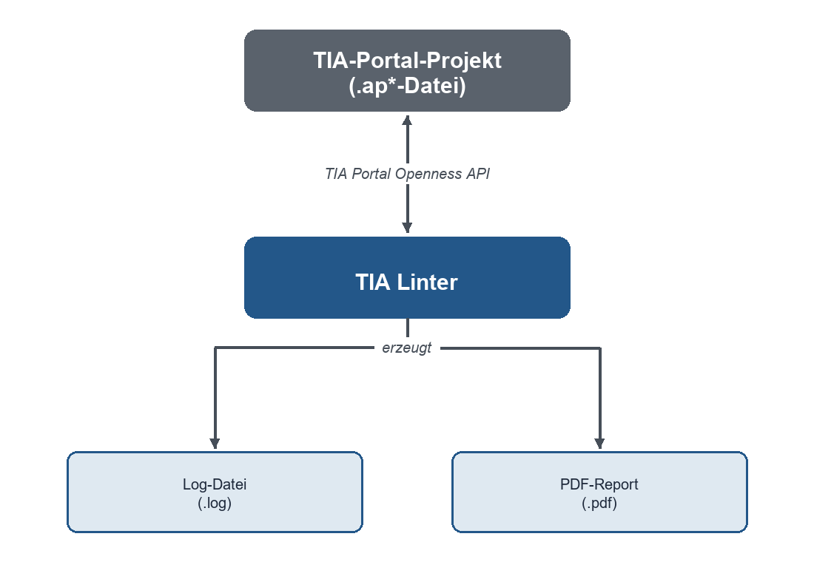

---

<div style="page-break-after: always;"></div>

## 3. Voraussetzungen

Damit der TIA Linter ein echtes Projekt prüfen kann, müssen folgende
Voraussetzungen erfüllt sein:

| Voraussetzung | Anmerkung |
|---|---|
| **TIA Portal V21** | Aktuell die einzige unterstützte Version. Weitere Versionen sind vorgesehen. |
| **Windows** | Die Schnittstelle zu TIA Portal (Openness API) ist eine Windows-Komponente. |
| **Python 3.11 oder neuer** | Wird für die Installation und den Betrieb des Programms benötigt. |

> **Wichtig:** TIA Portal muss während der Prüfung **nicht geöffnet** sein.
> Der Zugriff erfolgt im Hintergrund ("headless"). Näheres dazu in
> [Kapitel 4](#4-grundprinzip-der-prüfung).

Für reine Testzwecke ohne echtes TIA-Portal-Projekt steht zusätzlich ein
**Testmodus** zur Verfügung, der mit Beispielbefunden arbeitet (siehe
[Abschnitt 6.2](#62-die-eingabeseite)). In diesem Modus entfallen die oben
genannten Voraussetzungen.

---

<div style="page-break-after: always;"></div>

## 4. Grundprinzip der Prüfung

### 4.1 Ablauf in Kurzform

Ein Prüflauf besteht immer aus denselben Schritten:

1. Eine **TIA-Projektdatei** (`.ap*`) wird ausgewählt.
2. Ein **Output-Ordner** wird festgelegt, in dem später die Log-Datei und
   der PDF-Report gespeichert werden.
3. Eine **Konfigurationsdatei** legt fest, welche Prüfpunkte es überhaupt
   gibt, welche davon standardmäßig aktiv sind und mit welchen
   Schwellenwerten sie arbeiten.
4. Die gewünschten **Prüfpunkte** werden ausgewählt (einzeln oder
   kategorienweise).
5. Die Prüfung wird gestartet — Fortschritt und Meldungen laufen live in
   der Oberfläche mit.
6. Auf der Ergebnisseite können die Befunde gesichtet, gefiltert und
   abschließend als PDF-Report exportiert werden.

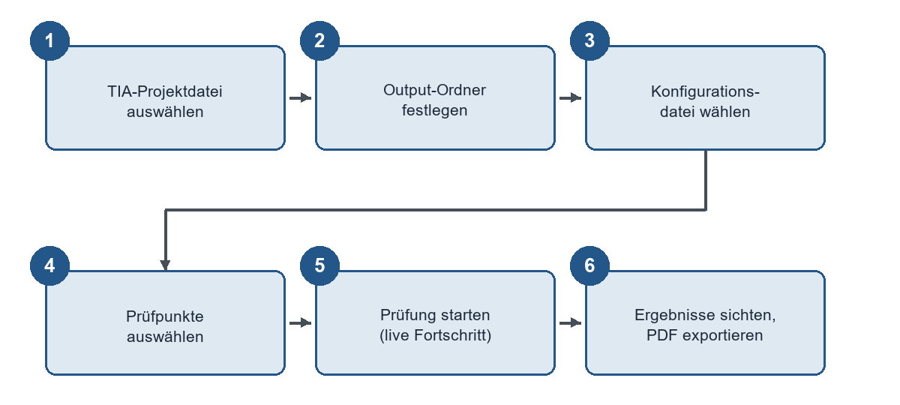

### 4.2 Wie die Verbindung zu TIA Portal funktioniert

Der TIA Linter verbindet sich über die **TIA Portal Openness API** mit dem
Projekt. Das ist eine offizielle Programmierschnittstelle von Siemens, über
die externe Programme lesend (und grundsätzlich auch schreibend) auf
TIA-Portal-Projekte zugreifen können. Der TIA Linter nutzt ausschließlich
die **lesenden** Möglichkeiten dieser Schnittstelle.

Die Verbindung wird **ohne sichtbare TIA-Portal-Oberfläche** aufgebaut. Es
ist also nicht nötig (und nicht vorgesehen), TIA Portal vorher manuell zu
öffnen.

Bei größeren Projekten baut das Programm die Verbindung zwischendurch
**automatisch neu auf** (Reconnect). Das ist ein reiner
Stabilitätsmechanismus im Hintergrund: TIA Portal begrenzt die Anzahl
gleichzeitig offener Objekte je Sitzung, und ältere TIA-Portal-Versionen
haben sich bei sehr langen Sitzungen gelegentlich unerwartet getrennt. Ein
Reconnect unterbricht die Prüfung nicht — bereits abgeschlossene Prüfpunkte
werden nicht wiederholt, und der Vorgang wird im Log sichtbar protokolliert.

### 4.3 Wie die Prüfpunkte organisiert sind

Damit die Oberfläche bei einer größeren Anzahl an Prüfpunkten übersichtlich
bleibt, sind alle Prüfpunkte **Kategorien** zugeordnet. Diese Kategorien
bilden die Gruppen, in denen die Prüfpunkte auf der Eingabeseite als
Kontrollkästchen angezeigt werden (siehe [Abschnitt 6.2](#62-die-eingabeseite)):

| Kategorie |
|---|
| Kommentare & Beschreibungen |
| Namenskonventionen |
| Programmstruktur |
| Hardware & Konfiguration |
| Projektmetadaten |
| Bibliotheken & Typen |
| Siemens Styleguide |

> Was innerhalb dieser Kategorien im Einzelnen geprüft wird, ist **nicht**
> Teil dieses Kapitels. Jeder einzelne Prüfpunkt wird ausführlich in
> [Kapitel 10](#10-die-prüfpunkte-im-detail) beschrieben, sobald dieser Teil
> des Handbuchs ergänzt ist.

### 4.4 Wie ein Befund bewertet wird

Jeder einzelne Prüfpunkt liefert für jedes untersuchte Objekt (z. B. einen
Baustein, eine Variable oder eine Projekteinstellung) genau einen von drei
möglichen Status:

| Status | Bedeutung |
|---|---|
| **OK** | Der Prüfpunkt wurde eingehalten. Kein Handlungsbedarf. |
| **Warnung** | Eine Abweichung von der Konvention wurde festgestellt, die den Betrieb nicht unmittelbar gefährdet. |
| **Fehler** | Eine schwerwiegende Abweichung wurde festgestellt, die dringend behoben werden sollte. |

Ob eine konkrete Abweichung als Warnung oder als Fehler gilt, ist für jeden
Prüfpunkt einzeln in der Konfigurationsdatei festgelegt (siehe
[Kapitel 5](#5-installation-und-einrichtung)) und kann bei Bedarf angepasst
werden.

---

<div style="page-break-after: always;"></div>

## 5. Installation und Einrichtung

### 5.1 Installation

Das Programm wird als Python-Paket installiert:

```bash
pip install -e .
```

Danach steht der Befehl `tia-linter` zur Verfügung, mit dem sich die
Oberfläche starten lässt (siehe [Kapitel 6](#6-bedienung-der-oberfläche)).

### 5.2 Die Konfigurationsdatei

Alle grundsätzlichen Einstellungen des Programms — welche TIA-Portal-Version
verwendet wird, welche Prüfpunkte es gibt, welche davon standardmäßig aktiv
sind und mit welchen Schwellenwerten sie arbeiten — stehen in einer
**YAML-Konfigurationsdatei**. Mitgeliefert wird eine Standardkonfiguration
unter `config/default.yaml`.

Es können beliebig viele eigene Konfigurationsdateien angelegt werden, zum
Beispiel eine je Kunde oder Projektstandard. Auf der Eingabeseite der
Oberfläche lässt sich die verwendete Konfigurationsdatei jederzeit
umschalten (siehe [Abschnitt 6.2](#62-die-eingabeseite)) — die Liste der
Prüfpunkt-Kontrollkästchen passt sich dann automatisch an.

> Die Konfigurationsdatei ist auch der Ort, an dem der **DLL-Pfad** der
> installierten TIA-Portal-Version hinterlegt ist. Dieser muss zur
> tatsächlichen Installation auf dem verwendeten Rechner passen.

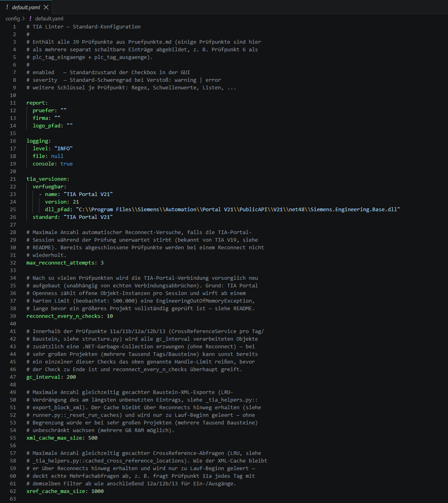

**Ordner von der Prüfung ausnehmen**

Über den Schlüssel `ausgeschlossene_ordner` lässt sich eine Liste von
Ordnernamen hinterlegen, die komplett von der Prüfung ausgenommen werden
sollen — zum Beispiel ein Bibliotheksordner, der bereits mehrfach geprüft
wurde und sich nicht mehr ändert:

```yaml
ausgeschlossene_ordner:
  - "Standardbibliothek"
  - "Bereits geprüft"
```

Ein ausgeschlossener Ordner nimmt automatisch auch **alle seine
Unterordner** von der Prüfung aus. Der Vergleich erfolgt rein anhand des
Ordnernamens (ohne Groß-/Kleinschreibung) — unabhängig davon, an welcher
Stelle im Projekt ein Ordner mit diesem Namen liegt. Die Einstellung gilt
gleichermaßen für Programmbausteine-, Datenbaustein- und
Variablentabellen-Ordner.

**Einzelne Bausteine von der Prüfung ausnehmen**

Über den Schlüssel `ausgeschlossene_bausteine` lässt sich zusätzlich eine
Liste einzelner Bausteinnamen hinterlegen (FB, FC, OB oder DB) — zum
Beispiel ein einzelner Altsystem-Baustein, der bewusst nicht mehr an
aktuelle Konventionen angepasst werden soll:

```yaml
ausgeschlossene_bausteine:
  - "FB_Altsystem"
  - "DB_Legacy_Rezepte"
```

Ein hier eingetragener Baustein wird **komplett von jedem Prüfpunkt**
ausgenommen — sowohl von Namensprüfungen (z. B.
[Prüfpunkt 5](#prüfpunkt-5-db-namensformat-global-array-db-und-instanz-db)
oder [7](#prüfpunkt-7-bausteinname-konvention-fbfc)) als auch von
Inhaltsprüfungen (z. B. Kommentare, unbenutzte Variablen,
Netzwerkkomplexität) — unabhängig davon, in welchem Ordner der Baustein
liegt. Der Vergleich erfolgt wie bei `ausgeschlossene_ordner` ohne
Berücksichtigung von Groß-/Kleinschreibung.

> Anders als `ausgeschlossene_ordner` gilt diese Einstellung ausschließlich
> für Programmbausteine und Datenbausteine — nicht für Variablentabellen
> oder einzelne PLC-Tags. Wer einzelne Variablen von der
> Kommentarprüfung ausnehmen möchte, nutzt stattdessen `ausnahme_prefixe`
> bei [Prüfpunkt 1](#prüfpunkt-1-variablen-ohne-kommentar).

### 5.3 Angaben für den Report

In der Konfigurationsdatei lassen sich außerdem allgemeine Angaben für das
Deckblatt des PDF-Reports hinterlegen, etwa der Name des Prüfers oder der
Firma (siehe [Kapitel 7](#7-der-pdf-report)).

---

<div style="page-break-after: always;"></div>

## 6. Bedienung der Oberfläche

Die Oberfläche des TIA Linters besteht aus zwei Seiten, zwischen denen das
Programm automatisch wechselt: der **Eingabeseite** (vor und während der
Prüfung) und der **Ergebnisseite** (nach Abschluss der Prüfung).

### 6.1 Programmstart

Das Programm wird über den Befehl

```bash
tia-linter
```

gestartet. Es öffnet sich ein einzelnes Fenster mit der Eingabeseite.
Fenstergröße und zuletzt verwendete Einstellungen werden automatisch
wiederhergestellt (siehe [Abschnitt 6.5](#65-gemerkte-einstellungen)).

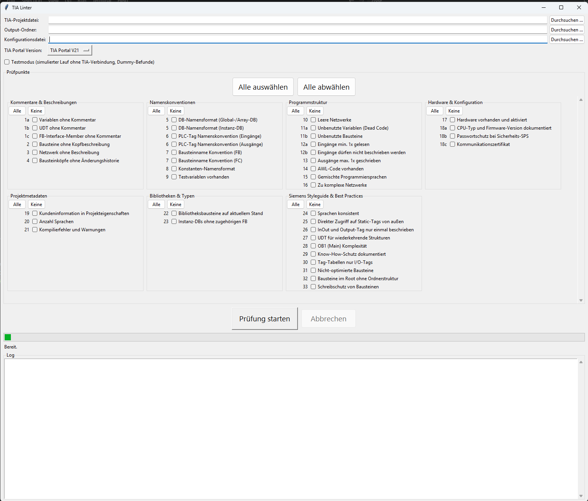

### 6.2 Die Eingabeseite

Die Eingabeseite gliedert sich von oben nach unten in folgende Bereiche:

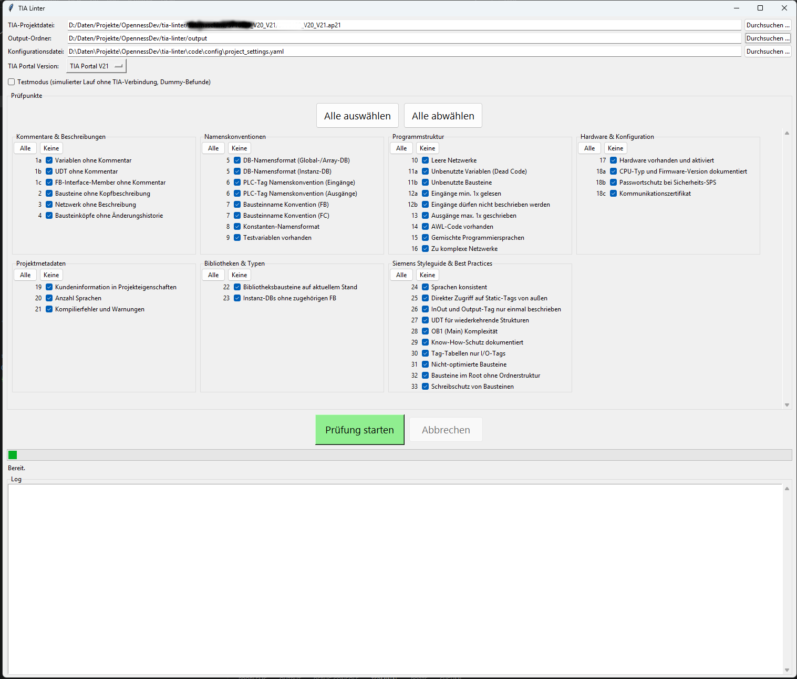

**1. Eingabefelder**

| Feld | Beschreibung |
|---|---|
| **TIA-Projektdatei** | Über "Durchsuchen …" wird die zu prüfende Projektdatei (`.ap*`) ausgewählt. |
| **Output-Ordner** | Der Ordner, in dem Log-Datei und PDF-Report abgelegt werden. |
| **Konfigurationsdatei** | Die YAML-Datei mit den Prüfpunkt-Definitionen (siehe [Abschnitt 5.2](#52-die-konfigurationsdatei)). Beim Wechsel wird die Liste der Prüfpunkte unten automatisch neu aufgebaut. |
| **TIA Portal Version** | Auswahl der zu verwendenden TIA-Portal-Version aus den in der Konfiguration hinterlegten Versionen. |

**2. Testmodus**

Über die Kontrollkästchen "Testmodus" lässt sich ein simulierter Prüflauf
**ohne echte TIA-Portal-Verbindung** durchführen, der mit Beispielbefunden
arbeitet. Das ist nützlich, um die Oberfläche, die Filterfunktionen oder den
PDF-Report kennenzulernen, ohne ein echtes Projekt zur Hand zu haben. Der
Testmodus ist standardmäßig **ausgeschaltet** — im Normalbetrieb wird also
echt geprüft.

**3. Prüfpunkte**

In diesem Bereich werden alle verfügbaren Prüfpunkte als Kontrollkästchen
angezeigt, gruppiert nach Kategorie (siehe [Abschnitt 4.3](#43-wie-die-prüfpunkte-organisiert-sind)).
Zur schnellen Auswahl stehen zur Verfügung:

- **"Alle auswählen" / "Alle abwählen"** — wirkt auf sämtliche Prüfpunkte.
- **"Alle" / "Keine"** je Kategorie — wirkt nur auf die Prüfpunkte der
  jeweiligen Kategorie.
- Einzelne Kontrollkästchen für jeden Prüfpunkt.

Welche Prüfpunkte hier standardmäßig angehakt sind, ist in der aktiven
Konfigurationsdatei festgelegt.

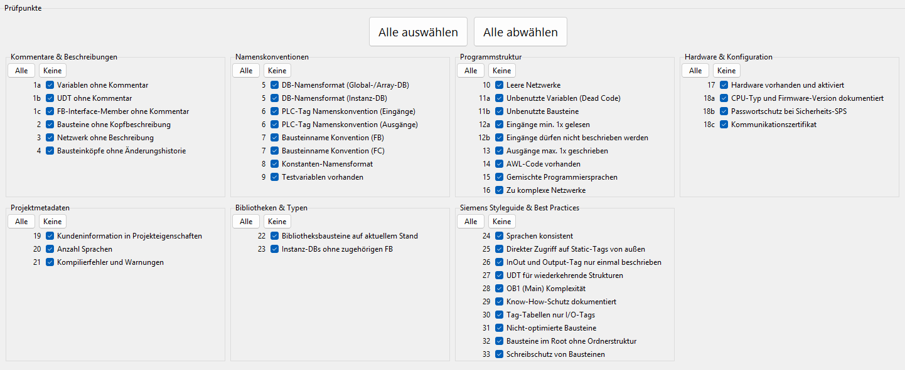

**4. Start, Fortschritt und Log**

- **"Prüfung starten"** beginnt den Prüflauf mit den aktuell ausgewählten
  Einstellungen. Der Button ist deaktiviert, solange keine Projektdatei,
  kein Output-Ordner oder kein Prüfpunkt ausgewählt ist.
- **"Abbrechen"** ist nur während eines laufenden Prüflaufs aktiv und bricht
  diesen kontrolliert ab.
- Eine **Fortschrittsanzeige** und eine **Statuszeile** zeigen, dass eine
  Prüfung läuft bzw. welche Meldung zuletzt eingegangen ist.
- Ein **Log-Fenster** zeigt alle Meldungen des laufenden Prüflaufs live und
  fortlaufend an.

### 6.3 Während der Prüfung

Während die Prüfung läuft, bleibt die Oberfläche bedienbar. Im Log-Fenster
erscheinen laufend Meldungen zum Fortschritt, unter anderem:

- welcher Prüfpunkt gerade bearbeitet wird,
- falls nötig, Hinweise zu einem automatischen Neuverbinden mit TIA Portal
  (siehe [Abschnitt 4.2](#42-wie-die-verbindung-zu-tia-portal-funktioniert)),
- eine Meldung, sobald die Prüfung abgeschlossen ist.

Über den Button **"Abbrechen"** kann die Prüfung jederzeit vorzeitig beendet
werden. Ein Abbruch wird angefordert und beim nächstmöglichen Zeitpunkt
ausgeführt — bereits ermittelte Befunde gehen dabei nicht verloren, es
werden lediglich keine weiteren Prüfpunkte mehr bearbeitet.

Sobald die Prüfung abgeschlossen ist, wechselt das Programm automatisch zur
Ergebnisseite.

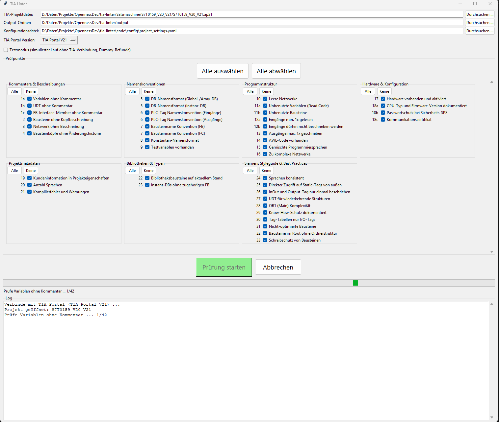

### 6.4 Die Ergebnisseite

Die Ergebnisseite zeigt die Befunde des zuletzt abgeschlossenen Prüflaufs.

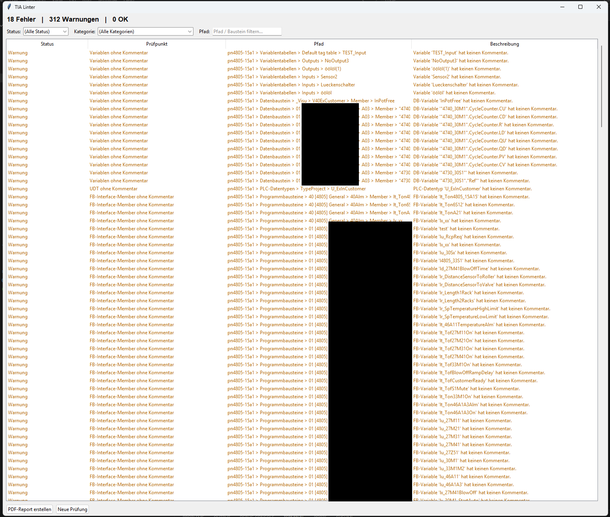

**1. Zusammenfassung**

Am oberen Rand steht eine kurze Zusammenfassung mit der Gesamtzahl an
Fehlern, Warnungen und OK-Befunden (siehe [Abschnitt 4.4](#44-wie-ein-befund-bewertet-wird)).

**2. Filter**

Die Befundtabelle lässt sich über drei Filter eingrenzen, die sich beliebig
kombinieren lassen:

| Filter | Wirkung |
|---|---|
| **Status** | Zeigt nur Befunde mit einem bestimmten Status (Fehler, Warnung, OK) oder alle. |
| **Kategorie** | Zeigt nur Befunde einer bestimmten Kategorie oder alle. |
| **Pfad** | Freitextsuche innerhalb des Pfads jedes Befunds (siehe [Kapitel 8](#8-das-pfad-format-der-befunde)), z. B. um alle Befunde zu einem bestimmten Baustein zu finden. |

**3. Befundtabelle**

Jede Zeile der Tabelle zeigt einen einzelnen Befund mit den Spalten
**Status**, **Prüfpunkt**, **Pfad** und **Beschreibung**. Der Status ist
farblich hervorgehoben: **Fehler** in Rot, **Warnung** in Orange, **OK** in
Grün.

Ein **Doppelklick** auf eine Zeile öffnet ein Detailfenster mit dem
vollständigen Pfad, der vollständigen Beschreibung des Befunds sowie einer
**Empfehlung zur Behebung**.

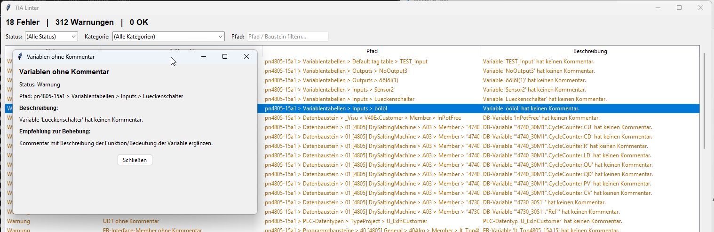

**4. Aktionen**

- **"PDF-Report erstellen"** erzeugt den vollständigen PDF-Report im
  gewählten Output-Ordner (siehe [Kapitel 7](#7-der-pdf-report)).
- **"Neue Prüfung"** kehrt zur Eingabeseite zurück, ohne die zuletzt
  verwendeten Einstellungen zu verwerfen.

### 6.5 Gemerkte Einstellungen

Das Programm merkt sich zwischen zwei Programmstarts automatisch:

- die Fenstergröße,
- die zuletzt verwendete Projektdatei und den zuletzt verwendeten
  Output-Ordner,
- die zuletzt verwendete Konfigurationsdatei,
- die zuletzt gewählte TIA-Portal-Version,
- den Zustand des Testmodus-Kontrollkästchens.

Diese Angaben werden lokal gespeichert und beim nächsten Start automatisch
wieder vorausgefüllt.

---

<div style="page-break-after: always;"></div>

## 7. Der PDF-Report

Der PDF-Report ist das zentrale Ergebnisdokument einer Prüfung und wird über
den Button "PDF-Report erstellen" auf der Ergebnisseite erzeugt (siehe
[Abschnitt 6.4](#64-die-ergebnisseite)). Er ist im DIN-A4-Format aufgebaut
und gliedert sich in drei Teile:

**1. Deckblatt**

Enthält den Projektnamen, die verwendete TIA-Portal-Version, das
Prüfdatum sowie — sofern in der Konfiguration hinterlegt — den Namen des
Prüfers und der Firma (siehe [Abschnitt 5.3](#53-angaben-für-den-report)).

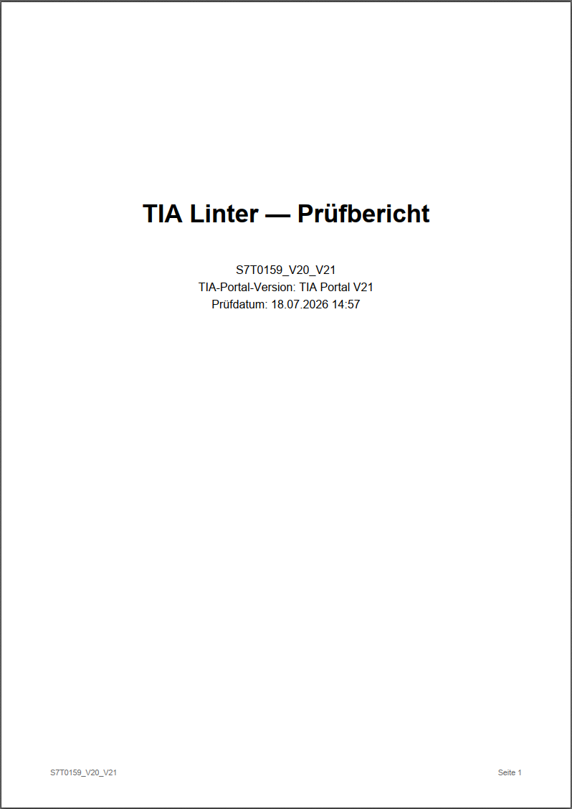

**2. Zusammenfassung**

Eine Übersichtsseite mit der Gesamtzahl an Fehlern, Warnungen und
OK-Befunden sowie einer Aufschlüsselung dieser Zahlen je Kategorie.

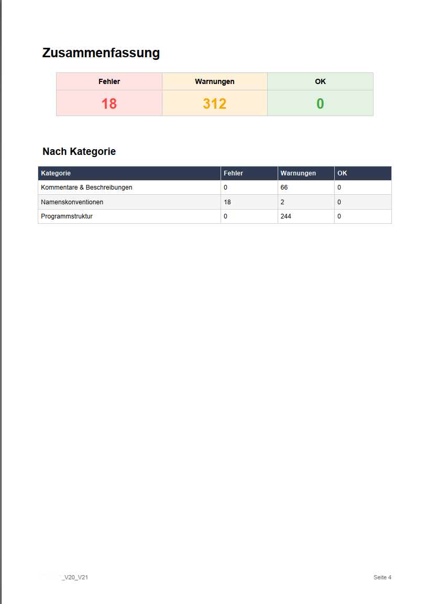

**3. Details**

Für jede Kategorie eine eigene Tabelle mit allen zugehörigen Befunden
(Status, Pfad, Beschreibung, Empfehlung zur Behebung) — farblich
hervorgehoben analog zur Befundtabelle in der Oberfläche.

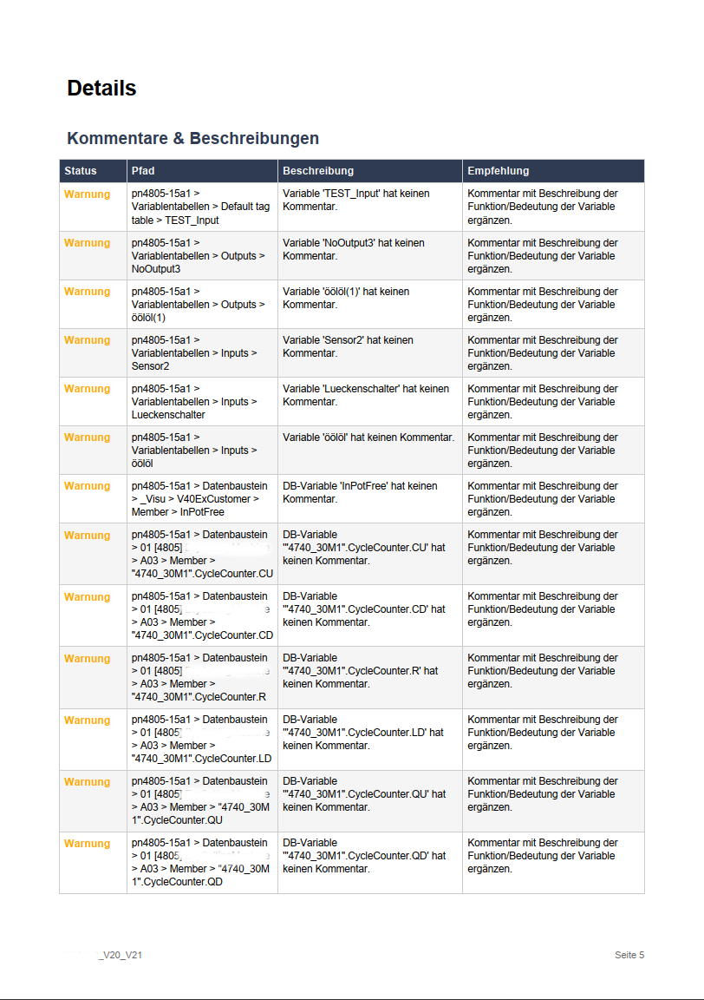

Der Dateiname wird automatisch nach folgendem Schema vergeben und im
gewählten Output-Ordner gespeichert:

```
Lintreport_{Projektname}_{Datum}_{Uhrzeit}.pdf
```

---

<div style="page-break-after: always;"></div>

## 8. Das Pfad-Format der Befunde

Jeder Befund — sowohl in der Oberfläche als auch im PDF-Report — zeigt den
vollständigen Pfad zum betroffenen Objekt im Projekt an. Die Ebenen der
Projekthierarchie werden dabei einheitlich durch `>` getrennt, vom
Allgemeinen zum Speziellen gelesen. Beispiele:

```
PLC_1 > Programmbausteine > FB_Motor > Netzwerk 3
PLC_1 > Variablentabellen > Tags_Eingaenge > I_Sensor_01
PLC_1 > Datenbaustein > DB_Rezept > Member > Solltemperatur
Projekt > Eigenschaften > Autor
```

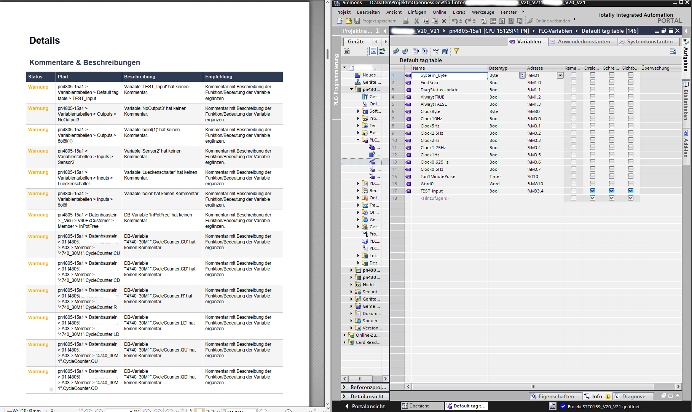

Dieses einheitliche Format erlaubt es, einen Befund im TIA-Portal-Projekt
gezielt wiederzufinden, und lässt sich über die Pfad-Filterung auf der
Ergebnisseite (siehe [Abschnitt 6.4](#64-die-ergebnisseite)) auch gezielt
durchsuchen.

---

<div style="page-break-after: always;"></div>

## 9. Die Protokolldatei (Log-Datei)

Zusätzlich zum PDF-Report schreibt jeder Prüflauf eine **Log-Datei** in den
gewählten Output-Ordner. Sie enthält denselben Ablauf, der während der
Prüfung auch im Log-Fenster der Oberfläche zu sehen ist (siehe
[Abschnitt 6.3](#63-während-der-prüfung)), jedoch dauerhaft gespeichert.

Der Dateiname wird automatisch nach folgendem Schema vergeben:

```
Lintlog_{Projektname}_{Datum}_{Uhrzeit}.log
```

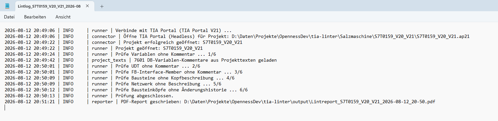

Die Log-Datei ist vor allem dann hilfreich, wenn ein Prüflauf unerwartet
abgebrochen wurde oder länger gedauert hat als erwartet — sie zeigt in
diesem Fall genau, bei welchem Schritt das Programm zuletzt war.

---

<div style="page-break-after: always;"></div>

## 10. Die Prüfpunkte im Detail

Dieses Kapitel beschreibt jeden einzelnen Prüfpunkt im Detail: was genau
geprüft wird, warum das relevant ist, welche Einstellungen dazu in der
Konfigurationsdatei zur Verfügung stehen, und wie ein Befund behoben wird.
Die Prüfpunkte sind — wie schon auf der Eingabeseite der Oberfläche (siehe
[Abschnitt 6.2](#62-die-eingabeseite)) — nach Kategorie gruppiert.

Jeder Prüfpunkt wird einheitlich nach folgendem Schema beschrieben:

- **Was wird geprüft?** — die eigentliche Prüflogik in einfachen Worten.
- **Warum ist das wichtig?** — der praktische Nutzen, wenn der Prüfpunkt
  eingehalten wird.
- **Parameter** — die zugehörigen Einstellungen in der Konfigurationsdatei
  (Schwellenwerte, Muster, Ausnahmen), sofern vorhanden.
- **Beispiel** — ein typischer Befund, wie er in der Befundtabelle oder im
  PDF-Report erscheinen würde.
- **Besonderheiten** — Sonderfälle und Ausnahmen, die der Prüfpunkt
  automatisch berücksichtigt.
- **Empfehlung zur Behebung** — wie ein gemeldeter Verstoß typischerweise
  aufgelöst wird.

Dieses Kapitel wird schrittweise ausgebaut. Der aktuelle Bearbeitungsstand:

| Unterkapitel | Kategorie | Prüfpunkte | Status |
|---|---|---|---|
| [10.1](#101-kommentare-beschreibungen-prüfpunkte-1-4) | Kommentare & Beschreibungen | 1–4 | ausgearbeitet |
| [10.2](#102-namenskonventionen-prüfpunkte-5-9) | Namenskonventionen | 5–9 | ausgearbeitet |
| [10.3](#103-programmstruktur-prüfpunkte-10-16) | Programmstruktur | 10–16 | ausgearbeitet |
| [10.4](#104-hardware-konfiguration-prüfpunkte-17-18c) | Hardware & Konfiguration | 17–18c | ausgearbeitet |
| [10.5](#105-projektmetadaten-prüfpunkte-19-22) | Projektmetadaten | 19–22 | ausgearbeitet |
| [10.6](#106-bibliotheken-typen-prüfpunkte-23-24) | Bibliotheken & Typen | 23–24 | ausgearbeitet |
| [10.7](#107-siemens-styleguide-best-practices-prüfpunkte-25-35) | Siemens Styleguide & Best Practices | 25–35 | ausgearbeitet |

### 10.1 Kommentare & Beschreibungen (Prüfpunkte 1-4)

Diese Kategorie prüft, ob ein Projekt so dokumentiert ist, dass sich auch
jemand, der es nicht selbst programmiert hat, darin zurechtfindet — eine
Grundvoraussetzung für Wartung, Fehlersuche und die Übergabe eines Projekts
an Kolleginnen und Kollegen oder an den Kunden.

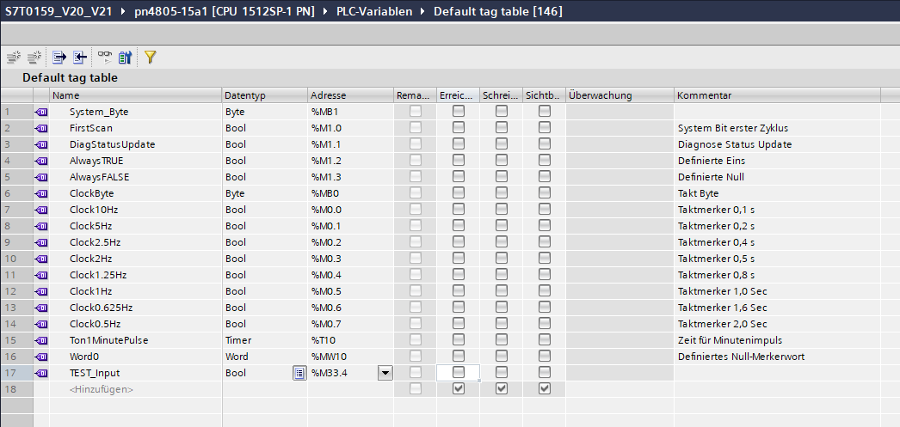

#### Prüfpunkt 1 — Variablen ohne Kommentar

| | |
|---|---|
| **Kategorie** | Kommentare & Beschreibungen |
| **Standard-Schweregrad** | Warnung |
| **Config-Schlüssel** | `checks.kommentare.variablen_kommentar` |

**Was wird geprüft?**
Für jeden PLC-Tag (in den Variablentabellen) und jede Variable innerhalb
eines Datenbausteins wird geprüft, ob ein Kommentar hinterlegt ist. Fehlt
der Kommentar oder besteht er nur aus Leerzeichen, wird ein Befund erzeugt.

**Warum ist das wichtig?**
Variablennamen allein erklären selten, wofür ein Signal tatsächlich steht
(z. B. welcher physische Sensor dahintersteht oder welchen Grenzwert eine
Zahl darstellt). Ohne Kommentar muss diese Information mühsam aus dem
Programmcode oder aus dem Anlagenplan rekonstruiert werden.

**Parameter**

| Parameter | Standardwert | Bedeutung |
|---|---|---|
| `ausnahme_prefixe` | `["__"]` | Variablen, deren Name mit einem dieser Präfixe beginnt, werden von der Prüfung ausgenommen. Ein einfacher Unterstrich eignet sich dafür in der Praxis oft nicht, da er häufig verwendet wird, um Variablennamen zu bilden, die nicht mit einer Ziffer beginnen dürfen/sollen — daher als Standard ein doppelter Unterstrich. |
| `ausnahme_variables` | `[]` | Einzelne Variablen, die unabhängig von `ausnahme_prefixe` von der Prüfung ausgenommen werden sollen — vollständiger Name, exakte Übereinstimmung (kein Präfix-/Teilstring-Abgleich). Gilt für PLC-Tags und DB-Member gleichermaßen; bei DB-Membern inkl. eines eventuellen Punktpfads (z. B. `"Alm.Station_1"`). |
| `ausnahme_udts` | `[]` | Datentypnamen (UDTs), deren Items von dieser Prüfung ausgenommen werden sollen — wirkt wie ein manueller Zusatzeintrag zu den automatisch erkannten UDTs (siehe [Prüfpunkt 1b](#prüfpunkt-1b-udt-ohne-kommentar)). Gedacht in erster Linie für System-/Bibliotheksdatentypen, die in TIA Portal nirgends als PLC-Datentyp sichtbar definiert sind (z. B. `"TON"`, `"IEC_TIMER"`) — für solche Typen gibt es keine Möglichkeit, ihr Inneres zu prüfen. Nur das UDT-typisierte Member selbst bleibt geprüft, seine Items werden übersprungen. |

**Beispiel**

```
PLC_1 > Variablentabellen > Tags_Eingaenge > I_Sensor_01
→ Variable 'I_Sensor_01' hat keinen Kommentar.
```

**Besonderheiten**

- Bei Datenbaustein-Variablen, die **Arrays** sind, genügt ein Kommentar
  auf dem Array selbst — die einzelnen Array-Elemente (z. B.
  `Rezepte[3]`) werden nicht zusätzlich einzeln bemängelt. Verschachtelte
  **Strukturen** (z. B. `Motor.Drehzahl`) gelten dagegen als eigenständige,
  einzeln zu kommentierende Variablen.
- Ist eine Datenbaustein-Variable vom Typ eines **PLC-Datentyps (UDT)**,
  gilt dieselbe Logik wie bei Arrays: Ein Kommentar auf der Variable
  selbst genügt, die einzelnen Items *innerhalb* des UDT werden hier
  nicht zusätzlich einzeln geprüft. Deren Kommentare (sowohl der des UDT
  selbst als auch die seiner Items) prüft stattdessen der separate
  [Prüfpunkt 1b](#prüfpunkt-1b-udt-ohne-kommentar). Diese UDT-Erkennung
  wirkt unabhängig davon, ob die Variable selbst über `ausnahme_prefixe`
  oder `ausnahme_variables` von der eigenen Kommentarprüfung ausgenommen
  ist — eine ausgenommene, aber UDT-typisierte Variable schützt ihre
  Items trotzdem vor Einzelprüfung.

**Empfehlung zur Behebung**
Kommentar mit Beschreibung der Funktion bzw. Bedeutung der Variable
ergänzen — z. B. welcher Anlagenteil betroffen ist oder was ein Grenzwert
bedeutet.

#### Prüfpunkt 1b — UDT ohne Kommentar

| | |
|---|---|
| **Kategorie** | Kommentare & Beschreibungen |
| **Standard-Schweregrad** | Warnung |
| **Config-Schlüssel** | `checks.kommentare.udt_kommentar` |

**Was wird geprüft?**
Für jeden PLC-Datentyp (UDT) im Projekt wird geprüft, ob er selbst einen
Kommentar hat, und zusätzlich für jedes seiner Items (Interface-Member),
ob dieses einen Kommentar hat. Fehlt einer der beiden, wird je ein
eigener Befund erzeugt.

**Warum ist das wichtig?**
Prüfpunkt 1 prüft Items *innerhalb* eines UDT-typisierten
Datenbaustein-Members bewusst nicht mehr einzeln (siehe dortige
Besonderheiten) — ein Kommentar auf der Variable selbst genügt dort,
analog zu Array-Elementen. Ohne diesen eigenen Prüfpunkt blieben die
Items eines UDT damit vollständig ungeprüft, egal wie oft und an wie
vielen Stellen der UDT im Projekt verwendet wird. Da ein UDT häufig an
vielen Stellen eingesetzt wird, lohnt sich die Kommentierung an der
UDT-Definition selbst ohnehin mehr als an jeder einzelnen
Verwendungsstelle.

**Parameter**

| Parameter | Standardwert | Bedeutung |
|---|---|---|
| `ausnahme_prefixe` | `["_"]` | UDTs bzw. Items, deren Name mit einem dieser Präfixe beginnt, werden von der Prüfung ausgenommen. |

**Beispiel**

```
PLC_1 > PLC-Datentypen > U_Motor
→ PLC-Datentyp 'U_Motor' hat keinen Kommentar.

PLC_1 > PLC-Datentypen > U_Motor > Member > Drehzahl
→ UDT-Variable 'Drehzahl' hat keinen Kommentar.
```

**Besonderheiten**

- War in der ursprünglichen Liste der 35 Prüfpunkte kein eigener Punkt —
  ergänzt Prüfpunkt 1 um eine Lücke, die erst durch dessen eigene
  UDT-Sonderbehandlung entstanden ist (siehe dort).
- Ist ein Item selbst wieder vom Typ eines (anderen oder desselben) UDT,
  wird ab dort **nicht** weiter in die Tiefe geprüft — dieses
  verschachtelte UDT wird eigenständig geprüft, sobald die Prüfung bei
  ihm ankommt. Jeder UDT wird also genau einmal an seiner Definition
  geprüft, unabhängig davon, wie oft und wo er im Projekt verwendet wird.
- Wie bei Prüfpunkt 1 genügt bei UDT-Items, die Arrays sind, ein
  Kommentar auf dem Array selbst.

**Empfehlung zur Behebung**
Kommentar auf dem PLC-Datentyp bzw. dem betroffenen Item ergänzen —
da ein UDT oft mehrfach verwendet wird, wirkt sich ein einmal ergänzter
Kommentar an der Definition überall dort aus, wo der Typ eingesetzt wird.

#### Prüfpunkt 2 — Bausteine ohne Kopfbeschreibung

| | |
|---|---|
| **Kategorie** | Kommentare & Beschreibungen |
| **Standard-Schweregrad** | Warnung |
| **Config-Schlüssel** | `checks.kommentare.baustein_beschreibung` |

**Was wird geprüft?**
Für jeden Baustein (FB, FC, OB, DB) wird die Kopfbeschreibung (das
Kommentarfeld der Bausteineigenschaften) geprüft. Fehlt sie oder ist sie
kürzer als die konfigurierte Mindestlänge, wird ein Befund erzeugt.

**Warum ist das wichtig?**
Die Kopfbeschreibung ist meist die erste Stelle, an der sich jemand über
Zweck und Funktionsweise eines Bausteins informiert, bevor er sich durch
die einzelnen Netzwerke arbeitet. Eine zu kurze oder fehlende Beschreibung
(z. B. nur ein Wort) erfüllt diesen Zweck nicht.

**Parameter**

| Parameter | Standardwert | Bedeutung |
|---|---|---|
| `min_laenge` | `20` | Mindestanzahl an Zeichen, die die Kopfbeschreibung haben muss, um als aussagekräftig zu gelten. |

**Beispiel**

```
PLC_1 > Programmbausteine > FB_Motor
→ Baustein 'FB_Motor' hat keine oder zu kurze Kopfbeschreibung
  (mind. 20 Zeichen erwartet).
```

**Empfehlung zur Behebung**
Kopfbeschreibung mit Zweck und Funktionsweise des Bausteins ergänzen — was
steuert oder überwacht der Baustein, und was sollte jemand wissen, bevor er
ihn ändert?

#### Prüfpunkt 3 — Netzwerk ohne Beschreibung

| | |
|---|---|
| **Kategorie** | Kommentare & Beschreibungen |
| **Standard-Schweregrad** | Warnung |
| **Config-Schlüssel** | `checks.kommentare.netzwerk_beschreibung` |

**Was wird geprüft?**
Für jedes Netzwerk innerhalb eines Bausteins wird geprüft, ob ein
Netzwerktitel vergeben ist. Fehlt der Titel, wird das gemeldet; ist er
länger als die konfigurierte Obergrenze, wird das ebenfalls gemeldet — ein
zu langer Titel ist auf Dauer meist kein prägnanter Titel mehr, sondern ein
Fließtext.

**Warum ist das wichtig?**
Ein kurzer, aussagekräftiger Netzwerktitel erlaubt es, einen Baustein zu
überfliegen, ohne jedes einzelne Netzwerk im Detail lesen zu müssen — das
beschleunigt sowohl die Einarbeitung als auch die Fehlersuche im laufenden
Betrieb erheblich.

**Parameter**

| Parameter | Standardwert | Bedeutung |
|---|---|---|
| `max_zeichen` | `80` | Maximale Länge des Netzwerktitels in Zeichen. |

**Beispiel**

```
PLC_1 > Programmbausteine > FB_Motor > Netzwerk 3
→ Netzwerk hat keinen Titel.
```

**Besonderheiten**

- Bausteine, die vollständig in **SCL oder AWL/STL** programmiert sind,
  besitzen keine einzelnen Netzwerke mit Titeln (das Konzept "Netzwerk"
  gibt es nur in den grafischen Sprachen KOP/FUP/GRAPH) — sie werden von
  diesem Prüfpunkt automatisch ausgenommen.

**Empfehlung zur Behebung**
Kurzen, prägnanten Netzwerktitel ergänzen, der zusammenfasst, was das
Netzwerk tut (z. B. "Freigabe Antrieb prüfen" statt keines Titels oder
eines mehrzeiligen Fließtexts).

#### Prüfpunkt 4 — Bausteinköpfe ohne Änderungshistorie

| | |
|---|---|
| **Kategorie** | Kommentare & Beschreibungen |
| **Standard-Schweregrad** | Warnung |
| **Config-Schlüssel** | `checks.kommentare.aenderungshistorie` |

**Was wird geprüft?**
Für jeden Baustein wird geprüft, ob im Bausteinkopf **sowohl** ein Autor
**als auch** eine Versionsangabe hinterlegt sind. Ein Befund entsteht nur,
wenn **beide** Angaben vollständig fehlen — ist mindestens eine der beiden
Angaben vorhanden, gilt der Prüfpunkt für diesen Baustein als erfüllt.

**Warum ist das wichtig?**
Autor und Version im Bausteinkopf machen nachvollziehbar, wer einen
Baustein zuletzt bearbeitet hat und ob es sich um den aktuellen Stand
handelt. Das ist besonders bei Projekten hilfreich, an denen mehrere
Personen über einen längeren Zeitraum arbeiten.

**Parameter**
Dieser Prüfpunkt hat keine konfigurierbaren Parameter.

**Beispiel**

```
PLC_1 > Programmbausteine > FB_Motor
→ Baustein 'FB_Motor' hat weder Autor noch Version im
  Bausteinkopf hinterlegt.
```

**Empfehlung zur Behebung**
Änderungshistorie im Bausteinkopf pflegen — mindestens Autor und
Versionsnummer, idealerweise ergänzt um Datum und eine Kurzbeschreibung der
Änderung, gemäß dem Siemens Standardisierungsleitfaden.

---

### 10.2 Namenskonventionen (Prüfpunkte 5-9)

Diese Kategorie prüft, ob sich Bausteine, Variablen und Konstanten anhand
ihres Namens auf den ersten Blick richtig einordnen lassen — ohne dass man
erst nachschauen muss, ob z. B. "Sensor_Endlage" ein Eingang oder ein
Ausgang ist, oder ob "Rezept_01" ein Datenbaustein oder etwas anderes ist.
Einheitliche Namen erleichtern außerdem die Suche im Projekt und das
Wiedererkennen von Mustern über mehrere Projekte hinweg.

Alle Prüfpunkte dieser Kategorie arbeiten mit **regulären Ausdrücken**
(Regex): einem in der Konfigurationsdatei hinterlegten Muster, gegen das
jeder betroffene Name geprüft wird. Wer mit regulären Ausdrücken nicht
vertraut ist, kann sich an den mitgelieferten Standardmustern orientieren
und sie bei Bedarf mit Unterstützung anpassen.

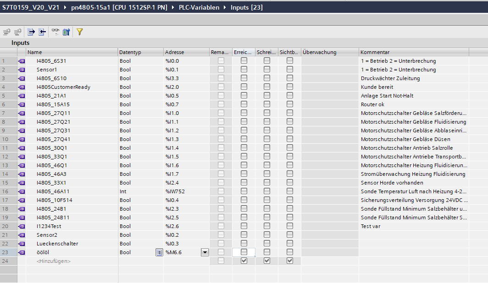

#### Prüfpunkt 5 — DB-Namensformat (Global-/Array-DB und Instanz-DB)

| | |
|---|---|
| **Kategorie** | Namenskonventionen |
| **Standard-Schweregrad** | Fehler |
| **Config-Schlüssel** | `checks.namenskonventionen.db_format_global` und `checks.namenskonventionen.db_format_instance` |

> Dieser eine Prüfpunkt ist in der Oberfläche als **zwei getrennte
> Kontrollkästchen** abgebildet — eines für Global-/Array-Datenbausteine,
> eines für Instanz-Datenbausteine — damit sich beide Arten unabhängig
> voneinander aktivieren und mit einem eigenen Muster konfigurieren lassen.
> Grund: Der Name eines Instanz-DBs wird meist automatisch aus dem
> zugehörigen FB-Aufruf abgeleitet und folgt in der Praxis oft einer
> komplett anderen Namenskonvention als frei benannte Global- oder
> Array-Datenbausteine.

**Was wird geprüft?**
Für jeden Datenbaustein wird der Name gegen das zur jeweiligen Art
passende Muster geprüft. Entspricht der Name nicht dem Muster, wird ein
Befund erzeugt.

**Warum ist das wichtig?**
Ein einheitliches Namenspräfix für Datenbausteine macht auf den ersten
Blick sichtbar, dass es sich um reine Datenablage handelt — im Unterschied
zu Bausteinen mit Programmlogik (FB/FC). Weil Instanz-DBs technisch anders
entstehen als Global-/Array-DBs, lohnt sich dafür meist ein eigenes
Namensschema statt eines gemeinsamen.

**Parameter**

| Parameter | Standardwert | Bedeutung |
|---|---|---|
| `regex` (Global-/Array-DB) | `^DB_[A-Za-z]` | Muster, dem Global- und Array-Datenbausteine entsprechen müssen. |
| `regex` (Instanz-DB) | `^DB_[A-Za-z]` | Muster, dem Instanz-Datenbausteine entsprechen müssen — unabhängig vom obigen Muster konfigurierbar. |

**Beispiel**

```
PLC_1 > Datenbaustein > Rezept_01
→ DB-Name 'Rezept_01' entspricht nicht dem Muster '^DB_[A-Za-z]'.
```

**Besonderheiten**

- Das Standardmuster prüft nur den **Anfang** des Namens (es endet nicht
  mit einem Endanker `$`) — es genügt also, dass der Name mit `DB_` und
  einem Buchstaben beginnt, der Rest des Namens ist frei wählbar. Wer eine
  strengere, vollständige Prüfung möchte, kann in der Konfiguration ein
  eigenes Muster mit `$` am Ende hinterlegen.
- **Array-Datenbausteine** werden zusammen mit Global-DBs geprüft (über
  `db_format_global`), nicht zusammen mit Instanz-DBs — beide werden vom
  Anwender frei benannt, im Gegensatz zum meist automatisch abgeleiteten
  Namen eines Instanz-DBs.

**Empfehlung zur Behebung**
Datenbaustein gemäß der für seine Art (Global-/Array-DB bzw. Instanz-DB)
geltenden Namenskonvention umbenennen.

#### Prüfpunkt 6 — PLC-Tag-Namenskonvention (Eingänge/Ausgänge)

| | |
|---|---|
| **Kategorie** | Namenskonventionen |
| **Standard-Schweregrad** | Fehler |
| **Config-Schlüssel** | `checks.namenskonventionen.plc_tag_eingaenge` und `checks.namenskonventionen.plc_tag_ausgaenge` |

> Dieser eine Prüfpunkt ist in der Oberfläche als **zwei getrennte
> Kontrollkästchen** abgebildet — eines für Eingänge, eines für Ausgänge —
> damit sich beide Richtungen unabhängig voneinander aktivieren und mit
> einem eigenen Muster konfigurieren lassen.

**Was wird geprüft?**
Für jeden PLC-Tag, der über eine feste Peripherie-Adresse verfügt (z. B.
`%I0.0` für einen Eingang oder `%Q4.1` für einen Ausgang), wird der
Tag-Name gegen das zur jeweiligen Richtung passende Muster geprüft. Ob ein
Tag als Eingang oder Ausgang gilt, wird dabei **anhand seiner Adresse**
bestimmt — nicht anhand des Namens selbst.

**Warum ist das wichtig?**
Ein Blick auf den Namen genügt, um zu erkennen, ob ein Signal von der
Anlage kommt oder zu ihr geht — das beschleunigt Fehlersuche und
Verdrahtungsabgleich erheblich.

**Parameter**

| Parameter | Standardwert | Bedeutung |
|---|---|---|
| `regex` (Eingänge) | `^I_` | Muster, dem Eingangs-Tags entsprechen müssen. |
| `regex` (Ausgänge) | `^Q_` | Muster, dem Ausgangs-Tags entsprechen müssen. |

**Beispiel**

```
PLC_1 > Variablentabellen > Tags_Eingaenge > Sensor_Endlage
→ Tag 'Sensor_Endlage' entspricht nicht dem Muster '^I_'.
```

**Besonderheiten**

- Tags **ohne feste Peripherie-Adresse** (z. B. rein interne Merker ohne
  Bezug zu einem Ein- oder Ausgang) werden von diesem Prüfpunkt
  automatisch nicht geprüft, da sie weder eindeutig Eingang noch Ausgang
  sind.

**Empfehlung zur Behebung**
Tag gemäß Namenskonvention für Eingänge bzw. Ausgänge umbenennen (siehe
Konfiguration).

#### Prüfpunkt 7 — Bausteinname-Konvention (FB/FC)

| | |
|---|---|
| **Kategorie** | Namenskonventionen |
| **Standard-Schweregrad** | Fehler |
| **Config-Schlüssel** | `checks.namenskonventionen.fb_prefix` und `checks.namenskonventionen.fc_prefix` |

> Auch dieser Prüfpunkt ist als **zwei getrennte Kontrollkästchen**
> abgebildet — eines für Funktionsbausteine (FB), eines für Funktionen (FC).

**Was wird geprüft?**
Für jeden Funktionsbaustein bzw. jede Funktion wird der Bausteinname gegen
das jeweils konfigurierte Muster geprüft. Organisationsbausteine (OB) sind
von diesem Prüfpunkt nicht betroffen; Datenbausteine werden bereits über
[Prüfpunkt 5](#prüfpunkt-5-db-namensformat-global-array-db-und-instanz-db) geprüft.

**Warum ist das wichtig?**
Ein einheitliches Präfix macht auf den ersten Blick erkennbar, ob ein
Baustein einen eigenen Instanz-Datenbaustein besitzt (FB) oder zustandslos
arbeitet (FC) — ein relevanter Unterschied beim Verständnis des
Programmablaufs.

**Parameter**

| Parameter | Standardwert | Bedeutung |
|---|---|---|
| `regex` (FB) | `^FB_\S*$` | Muster, dem Funktionsbaustein-Namen entsprechen müssen. |
| `regex` (FC) | `^FC_\S*$` | Muster, dem Funktions-Namen entsprechen müssen. |

**Beispiel**

```
PLC_1 > Programmbausteine > Motor_Steuerung
→ Bausteinname 'Motor_Steuerung' entspricht nicht dem Muster '^FB_\S*$'.
```

**Besonderheiten**

- Anders als bei Prüfpunkt 5 endet das Standardmuster hier mit einem
  Endanker (`$`) — geprüft wird also der **gesamte** Bausteinname, nicht
  nur der Anfang.

**Empfehlung zur Behebung**
Funktionsbaustein bzw. Funktion gemäß Namenskonvention umbenennen (siehe
Konfiguration).

#### Prüfpunkt 8 — Konstanten-Namensformat

| | |
|---|---|
| **Kategorie** | Namenskonventionen |
| **Standard-Schweregrad** | Warnung |
| **Config-Schlüssel** | `checks.namenskonventionen.konstanten_format` |

**Was wird geprüft?**
Für globale Konstanten innerhalb einer Variablentabelle wird der Name gegen
das konfigurierte Muster geprüft — im Standard: nur Großbuchstaben, Ziffern
und Unterstriche, beginnend mit einem Buchstaben.

**Warum ist das wichtig?**
Durchgängig großgeschriebene Konstanten sind auf den ersten Blick von
normalen (veränderlichen) Variablen zu unterscheiden — eine in der
Programmierung weit verbreitete Konvention.

**Parameter**

| Parameter | Standardwert | Bedeutung |
|---|---|---|
| `regex` | `^[A-Z][A-Z0-9_]*$` | Muster, dem der Konstantenname entsprechen muss. |

**Beispiel**

```
PLC_1 > Variablentabellen > Tags_Allgemein > MaxDrehzahl
→ Konstante 'MaxDrehzahl' entspricht nicht dem Muster '^[A-Z][A-Z0-9_]*$'.
```

**Besonderheiten**

- Enthält eine Variablentabelle keine globalen Konstanten, wird sie für
  diesen Prüfpunkt übersprungen, ohne einen Befund zu erzeugen.

**Empfehlung zur Behebung**
Konstantenname gemäß Namenskonvention anpassen (siehe Konfiguration).

#### Prüfpunkt 9 — Testvariablen vorhanden

| | |
|---|---|
| **Kategorie** | Namenskonventionen |
| **Standard-Schweregrad** | Warnung |
| **Config-Schlüssel** | `checks.namenskonventionen.testvariablen` |

**Was wird geprüft?**
Anders als die übrigen Prüfpunkte dieser Kategorie prüft dieser Punkt
nicht, ob ein Name einem Muster entspricht, sondern ob im Projekt
überhaupt noch PLC-Tags vorhanden sind, deren Name mit einem der
konfigurierten "Test-Präfixe" beginnt.

**Warum ist das wichtig?**
Test- und Debug-Variablen werden während der Entwicklung oft temporär
angelegt und danach vergessen. Sie blähen das Projekt unnötig auf und
bergen das Risiko, versehentlich mit produktiven Variablen verwechselt zu
werden.

**Parameter**

| Parameter | Standardwert | Bedeutung |
|---|---|---|
| `prefixe` | `["TEST_", "DEBUG_", "_TEMP"]` | Liste von Namenspräfixen, die als Testvariable gelten. |

**Beispiel**

```
PLC_1 > Variablentabellen > Tags_Allgemein > TEST_Handbetrieb
→ Testvariable 'TEST_Handbetrieb' ist noch im Projekt vorhanden.
```

**Besonderheiten**

- Ist die Präfixliste in der Konfiguration leer, liefert dieser Prüfpunkt
  grundsätzlich keine Befunde.

**Empfehlung zur Behebung**
Prüfen, ob die Testvariable noch benötigt wird — andernfalls entfernen.

---

### 10.3 Programmstruktur (Prüfpunkte 10-16)

Diese Kategorie prüft den eigentlichen Programmaufbau: Gibt es toten Code
(leere Netzwerke, unbenutzte Variablen und Bausteine)? Werden Ein- und
Ausgänge so verwendet, wie man es von ihnen erwartet? Ist die Struktur
einheitlich und überschaubar (Sprache, Netzwerkgröße)? Diese Prüfpunkte
zielen direkt auf die **Lesbarkeit und Verlässlichkeit der Programmlogik**
ab — nicht nur auf äußere Form wie Kommentare oder Namen.

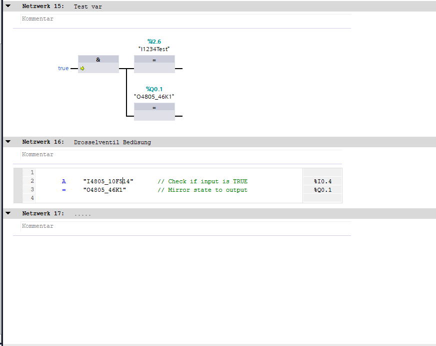

#### Prüfpunkt 10 — Leere Netzwerke

| | |
|---|---|
| **Kategorie** | Programmstruktur |
| **Standard-Schweregrad** | Warnung |
| **Config-Schlüssel** | `checks.programmstruktur.leere_netzwerke` |

**Was wird geprüft?**
Für jedes Netzwerk eines grafisch programmierten Bausteins wird geprüft, ob
es überhaupt Programmelemente enthält (Kontakte, Spulen, Bausteinaufrufe
usw.). Ist ein Netzwerk vollständig leer, wird ein Befund erzeugt.

**Warum ist das wichtig?**
Leere Netzwerke sind meist Überbleibsel aus der Entwicklung — etwa
Platzhalter oder Reste gelöschter Logik. Sie tragen nichts zur Funktion bei,
verlängern den Baustein unnötig und sorgen bei der Fehlersuche für die
Frage: "Fehlt hier etwas, oder ist das Netzwerk absichtlich leer?"

**Parameter**
Dieser Prüfpunkt hat keine konfigurierbaren Parameter.

**Beispiel**

```
PLC_1 > Programmbausteine > FB_Motor > Netzwerk 5
→ Netzwerk ist leer (keine Programmelemente).
```

**Besonderheiten**

- Wie bei [Prüfpunkt 3](#prüfpunkt-3-netzwerk-ohne-beschreibung) gibt es
  das Konzept "Netzwerk" nur in den grafischen Sprachen (KOP/FUP/GRAPH) —
  Bausteine in SCL oder AWL/STL werden automatisch nicht geprüft.

**Empfehlung zur Behebung**
Leeres Netzwerk mit Logik befüllen oder entfernen.

#### Prüfpunkt 11 — Unbenutzte Variablen (Dead Code)

| | |
|---|---|
| **Kategorie** | Programmstruktur |
| **Standard-Schweregrad** | Warnung |
| **Config-Schlüssel** | `checks.programmstruktur.unbenutzte_variablen` |

**Was wird geprüft?**
Für jeden PLC-Tag und jede Variable innerhalb eines Datenbausteins wird
geprüft, ob sie irgendwo im Projekt tatsächlich verwendet wird (lesend oder
schreibend). Wird keine einzige Verwendung gefunden, gilt die Variable als
unbenutzt.

**Warum ist das wichtig?**
Unbenutzte Variablen sind "toter Code": Sie belegen Speicher und Adressraum,
tauchen unnötig in Kreuzreferenzen und Exporten auf und können bei einer
späteren Aufräumaktion fälschlich für "wird noch gebraucht" gehalten
werden.

**Parameter**
Dieser Prüfpunkt hat keine konfigurierbaren Parameter.

**Beispiel**

```
PLC_1 > Variablentabellen > Tags_Allgemein > Merker_Testlauf
→ Variable 'Merker_Testlauf' wird im gesamten Programm nicht verwendet.
```

**Besonderheiten**

- PLC-Tags und Variablen innerhalb eines Datenbausteins werden technisch
  auf unterschiedlichen Wegen geprüft (unterschiedliche Openness-Dienste).
  Für die Nutzung der Oberfläche macht das keinen Unterschied — das
  Ergebnis ist in beiden Fällen ein Befund mit derselben Aussage:
  "wird nirgends verwendet".

**Empfehlung zur Behebung**
Unbenutzte Variable entfernen oder die fehlende Verwendung ergänzen.

#### Prüfpunkt 11b — Unbenutzte Bausteine

| | |
|---|---|
| **Kategorie** | Programmstruktur |
| **Standard-Schweregrad** | Warnung |
| **Config-Schlüssel** | `checks.programmstruktur.unbenutzte_bausteine` |

**Was wird geprüft?**
Ergänzend zu Prüfpunkt 11, aber auf Bausteinebene: Für jeden
Funktionsbaustein (FB), jede Funktion (FC) und jeden Datenbaustein (DB)
wird geprüft, ob er von irgendeiner Stelle im Projekt aufgerufen bzw.
referenziert wird.

**Warum ist das wichtig?**
Ungenutzte Bausteine erschweren die Übersicht über ein Projekt und können
bei künftigen Erweiterungen versehentlich für aktive Logik gehalten werden,
obwohl sie längst funktionslos sind.

**Parameter**
Dieser Prüfpunkt hat keine konfigurierbaren Parameter.

**Beispiel**

```
PLC_1 > Programmbausteine > FB_Reserve_Alt
→ Baustein 'FB_Reserve_Alt' wird von keiner Stelle im Projekt referenziert.
```

**Besonderheiten**

- **Organisationsbausteine (OB)** sind von diesem Prüfpunkt ausgenommen:
  Sie werden planmäßig vom Betriebssystem der Steuerung aufgerufen (z. B.
  OB1 zyklisch), nicht von anderem Anwendercode. Eine fehlende Referenz im
  Programmcode ist bei ihnen normal und kein Hinweis auf toten Code.

**Empfehlung zur Behebung**
Unbenutzten Baustein entfernen oder den fehlenden Aufruf ergänzen.

#### Prüfpunkt 12 — Eingänge mindestens einmal gelesen

| | |
|---|---|
| **Kategorie** | Programmstruktur |
| **Standard-Schweregrad** | Warnung |
| **Config-Schlüssel** | `checks.programmstruktur.eingaenge_gelesen` |

**Was wird geprüft?**
Für jeden Eingangs-Tag (siehe [Prüfpunkt 6](#prüfpunkt-6-plc-tag-namenskonvention-eingängeausgänge))
wird geprüft, ob er im Programm mindestens einmal **lesend** verwendet
wird. Wird er nirgends gelesen, wird ein Befund erzeugt.

**Warum ist das wichtig?**
Ein Eingang, der nie gelesen wird, hat keinerlei Einfluss auf das
Programmverhalten. Entweder wurde seine Auswertung schlicht vergessen,
oder das Signal wird gar nicht mehr benötigt — dann sind Verdrahtung und
Projektierung dieses Eingangs überflüssig.

**Parameter**
Dieser Prüfpunkt hat keine konfigurierbaren Parameter.

**Beispiel**

```
PLC_1 > Variablentabellen > Tags_Eingaenge > I_Reserve_03
→ Eingang 'I_Reserve_03' wird im Programm nie gelesen.
```

**Besonderheiten**

- Anders als Prüfpunkt 11 (irgendeine Verwendung genügt) unterscheidet
  dieser Prüfpunkt gezielt zwischen **Lese-** und **Schreibzugriffen** —
  geprüft wird ausschließlich, ob tatsächlich gelesen wird. Ob ein Eingang
  fälschlich auch **beschrieben** wird, prüft der separate
  [Prüfpunkt 12b](#prüfpunkt-12b-eingänge-dürfen-nicht-beschrieben-werden).

**Empfehlung zur Behebung**
Prüfen, ob der Eingang tatsächlich benötigt wird — andernfalls Beschaltung
bzw. Tag entfernen.

#### Prüfpunkt 12b — Eingänge dürfen nicht beschrieben werden

| | |
|---|---|
| **Kategorie** | Programmstruktur |
| **Standard-Schweregrad** | Fehler |
| **Config-Schlüssel** | `checks.programmstruktur.eingaenge_nicht_beschrieben` |

**Was wird geprüft?**
Für jeden Eingangs-Tag wird gezählt, an wie vielen Stellen im Programm
**schreibend** darauf zugegriffen wird. Wird er auch nur an einer einzigen
Stelle beschrieben, wird ein Befund erzeugt.

**Warum ist das wichtig?**
Eingänge werden bei jedem SPS-Zyklus vom Prozessabbild automatisch aus der
Hardware überschrieben. Ein Schreibzugriff aus dem Anwenderprogramm hat
dadurch keinerlei dauerhafte Wirkung — der geschriebene Wert wird spätestens
im nächsten Zyklus wieder verworfen. Bestenfalls täuscht er also einen Wert
vor, der so real nie ankommt; meist ist er schlicht eine Verwechslung mit
einem Merker. Diese Regel gehört zu den grundlegendsten Konventionen der
SPS-Programmierung, war in der ursprünglichen Liste der Prüfpunkte aber
nicht als eigener Punkt enthalten — dieser Prüfpunkt schließt die Lücke.

**Parameter**
Dieser Prüfpunkt hat keine konfigurierbaren Parameter.

**Beispiel**

```
PLC_1 > Variablentabellen > Tags_Eingaenge > I_Sensor_01
→ Eingang 'I_Sensor_01' wird im Programm an 1 Stelle(n) beschrieben —
  Eingänge dürfen nicht beschrieben werden.
```

**Besonderheiten**

- Anders als bei [Prüfpunkt 13](#prüfpunkt-13-ausgänge-maximal-einmal-geschrieben)
  (Ausgänge dürfen mehrfach, aber nicht **mehrfach** beschrieben werden)
  genügt hier bereits ein **einziger** Schreibzugriff für einen Befund —
  Eingänge dürfen grundsätzlich gar nicht beschrieben werden.
- Der Standard-Schweregrad ist **Fehler**, nicht Warnung wie bei den
  meisten übrigen Prüfpunkten dieser Kategorie.

**Empfehlung zur Behebung**
Schreibzugriff auf den Eingang entfernen — Eingänge sind nur lesend zu
verwenden. Falls ein veränderbarer Wert benötigt wird, eine separate
Merker- bzw. Hilfsvariable verwenden.

#### Prüfpunkt 13 — Ausgänge maximal einmal geschrieben

| | |
|---|---|
| **Kategorie** | Programmstruktur |
| **Standard-Schweregrad** | Fehler |
| **Config-Schlüssel** | `checks.programmstruktur.ausgaenge_mehrfach_schreiben` |

**Was wird geprüft?**
Für jeden Ausgangs-Tag wird gezählt, an wie vielen Stellen im Programm
**schreibend** darauf zugegriffen wird. Wird er an mehr als einer Stelle
beschrieben, wird ein Befund erzeugt.

**Warum ist das wichtig?**
Wird derselbe Ausgang an mehreren Stellen im Programm beschrieben,
überschreiben sich die Zuweisungen je nach Ausführungsreihenfolge
gegenseitig — das Ergebnis hängt dann von der Bearbeitungsreihenfolge der
Bausteine ab und ist kaum noch vorhersehbar. Das gilt als einer der
klassischen, schwer zu findenden Programmierfehler in der SPS-Technik.

**Parameter**
Dieser Prüfpunkt hat keine konfigurierbaren Parameter.

**Beispiel**

```
PLC_1 > Variablentabellen > Tags_Ausgaenge > Q_Ventil_02
→ Ausgang 'Q_Ventil_02' wird an 3 Stellen beschrieben.
```

**Besonderheiten**

- Der Standard-Schweregrad ist hier **Fehler** statt Warnung wie bei den
  meisten übrigen Prüfpunkten dieser Kategorie — das unterstreicht, wie
  ernst dieser Verstoß typischerweise einzustufen ist.

**Empfehlung zur Behebung**
Schreibzugriffe auf den Ausgang auf eine einzige Stelle im Programm
konsolidieren.

#### Prüfpunkt 14 — AWL-Code vorhanden

| | |
|---|---|
| **Kategorie** | Programmstruktur |
| **Standard-Schweregrad** | Warnung |
| **Config-Schlüssel** | `checks.programmstruktur.awl_code` |

**Was wird geprüft?**
Für jeden Baustein wird geprüft, ob er in AWL/STL ("Anweisungsliste" /
"Statement List") programmiert ist.

**Warum ist das wichtig?**
AWL gilt bei Siemens als veraltete Programmiersprache: TIA Portal
unterstützt sie zwar weiterhin, entwickelt sie aber nicht mehr aktiv weiter
und empfiehlt sie nicht für neue Projekte. AWL-Code gilt zudem als deutlich
schwerer lesbar als die grafischen Sprachen (KOP/FUP) oder SCL.

**Parameter**
Dieser Prüfpunkt hat keine konfigurierbaren Parameter.

**Beispiel**

```
PLC_1 > Programmbausteine > FC_Altcode
→ Baustein 'FC_Altcode' ist in AWL (STL) programmiert.
```

**Empfehlung zur Behebung**
Baustein nach KOP, FUP oder SCL migrieren.

#### Prüfpunkt 15 — Gemischte Programmiersprachen

| | |
|---|---|
| **Kategorie** | Programmstruktur |
| **Standard-Schweregrad** | Warnung |
| **Config-Schlüssel** | `checks.programmstruktur.gemischte_sprachen` |

**Was wird geprüft?**
Für jeden Baustein wird geprüft, welche Programmiersprachen innerhalb
seiner einzelnen Netzwerke verwendet werden. Kommt mehr als eine Sprache
vor (z. B. ein Teil in KOP, ein anderer in FUP), wird ein Befund erzeugt.

**Warum ist das wichtig?**
Wechselt die Sprache innerhalb eines Bausteins, muss man beim Lesen
ständig zwischen unterschiedlichen Darstellungsweisen "umschalten" — das
erschwert das Verständnis unnötig. Ein Baustein sollte durchgängig in
einer Sprache programmiert sein.

**Parameter**
Dieser Prüfpunkt hat keine konfigurierbaren Parameter.

**Beispiel**

```
PLC_1 > Programmbausteine > FB_Mischbetrieb
→ Baustein 'FB_Mischbetrieb' mischt mehrere Sprachen: FBD, LAD.
```

**Besonderheiten**

- Wie bei Prüfpunkt 10 und 16 gilt auch dieser Prüfpunkt nur für Bausteine
  mit einzelnen Netzwerken (KOP/FUP/GRAPH). Bausteine, die komplett in SCL
  oder AWL/STL programmiert sind, werden automatisch nicht geprüft.

**Empfehlung zur Behebung**
Baustein auf eine einheitliche Programmiersprache vereinheitlichen.

#### Prüfpunkt 16 — Zu komplexe Netzwerke

| | |
|---|---|
| **Kategorie** | Programmstruktur |
| **Standard-Schweregrad** | Warnung |
| **Config-Schlüssel** | `checks.programmstruktur.max_netzwerk_elemente` |

**Was wird geprüft?**
Für jedes Netzwerk wird die Anzahl der enthaltenen Programmelemente
(Kontakte, Spulen, Bausteinaufrufe, Verknüpfungen usw.) gezählt und mit
dem konfigurierten Schwellenwert verglichen. Wird der Schwellenwert
überschritten, wird ein Befund erzeugt.

**Warum ist das wichtig?**
Sehr umfangreiche Netzwerke sind auf einen Blick schwer zu erfassen und
deuten häufig darauf hin, dass mehrere Teilfunktionen in ein einziges
Netzwerk gequetscht wurden, statt sie sinnvoll aufzuteilen.

**Parameter**

| Parameter | Standardwert | Bedeutung |
|---|---|---|
| `max_elemente` | `50` | Maximale Anzahl an Programmelementen je Netzwerk. |

**Beispiel**

```
PLC_1 > Programmbausteine > FB_Rezeptverwaltung > Netzwerk 2
→ Netzwerk hat 87 Elemente (Schwellenwert: 50).
```

**Besonderheiten**

- Gilt wie Prüfpunkt 10 und 15 nur für grafische Sprachen — SCL und
  AWL/STL kennen kein Netzwerk mit einer "Elementanzahl" in diesem Sinn
  und werden daher nicht geprüft.

**Empfehlung zur Behebung**
Netzwerk aufteilen oder die Teilfunktion in einen eigenen Baustein
auslagern.

---

### 10.4 Hardware & Konfiguration (Prüfpunkte 17-18c)

Diese Kategorie verlässt die Ebene des Programmcodes und prüft die
**Projektierung der Anlage selbst**: Ist überhaupt Peripherie-Hardware
konfiguriert, sind CPU-Typ und Firmware eindeutig dokumentiert, ist ein
eventuell vorhandenes Sicherheitsprogramm gegen unautorisierte Änderungen
geschützt, und sind die Kommunikationszertifikate gültig?

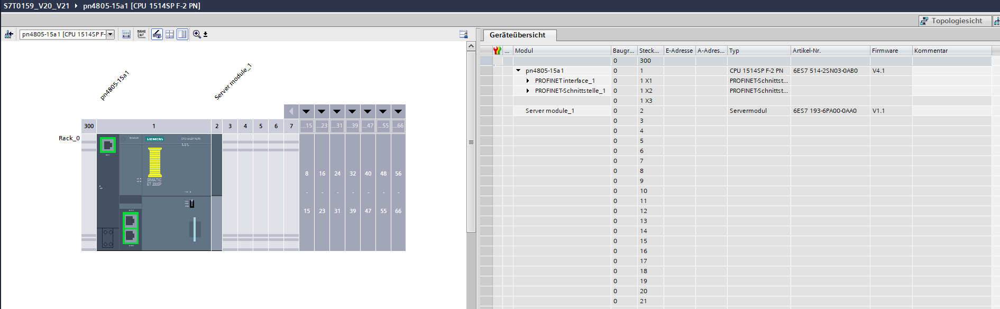

#### Prüfpunkt 17 — Hardware vorhanden und aktiviert

| | |
|---|---|
| **Kategorie** | Hardware & Konfiguration |
| **Standard-Schweregrad** | Fehler |
| **Config-Schlüssel** | `checks.hardware.hardware_vorhanden` |

**Was wird geprüft?**
Für jede projektierte PLC wird geprüft, ob außer der CPU selbst noch
mindestens ein weiteres Hardware-Modul konfiguriert ist (z. B. eine
Ein-/Ausgangsbaugruppe). Ist die PLC komplett ohne solche Zusatzmodule
projektiert, wird ein Befund erzeugt.

**Warum ist das wichtig?**
Ein Programm mit Ein-/Ausgangs-Tags setzt in aller Regel voraus, dass auch
die passende Hardware dafür projektiert ist. Fehlt jegliche Zusatz-Hardware,
deutet das entweder auf eine unvollständige Hardware-Konfiguration hin,
oder darauf, dass die reale Anlage über ein anderes Gerät angesprochen wird
als im Projekt hinterlegt.

**Parameter**
Dieser Prüfpunkt hat keine konfigurierbaren Parameter.

**Beispiel**

```
PLC_1 > Hardwarekonfiguration
→ PLC 'PLC_1' hat keine zusätzlichen Hardware-Module konfiguriert
  (nur die CPU selbst).
```

**Besonderheiten**

- Dieser Prüfpunkt ist bewusst vereinfacht: Er gleicht **nicht** ab, ob für
  jeden einzelnen I/O-Tag exakt das passende Adressbereichs-Modul
  vorhanden ist — das wäre ein deutlich aufwendigerer Abgleich. Geprüft
  wird nur, ob überhaupt zusätzliche Hardware projektiert ist. Eine PLC
  ganz ohne jede Zusatz-Hardware gilt als auffällig genug, um gemeldet zu
  werden.

**Empfehlung zur Behebung**
Hardware-Konfiguration prüfen — fehlendes Modul projektieren/aktivieren
oder nicht mehr benötigten Tag entfernen.

#### Prüfpunkt 18 — CPU-Typ und Firmware-Version dokumentiert

| | |
|---|---|
| **Kategorie** | Hardware & Konfiguration |
| **Standard-Schweregrad** | Warnung |
| **Config-Schlüssel** | `checks.hardware.cpu_firmware_dokumentiert` |

**Was wird geprüft?**
Für jede CPU wird geprüft, ob sowohl die Bestellnummer (CPU-Typ) als auch
die Firmware-Version auslesbar hinterlegt sind. Fehlt eine der beiden
Angaben, wird ein Befund erzeugt, der konkret benennt, welche Angabe fehlt.

**Warum ist das wichtig?**
Bei Rückfragen, Ersatzteilbeschaffung oder einem Firmware-Update muss
bekannt sein, um welche exakte CPU-Variante und Firmware-Version es sich
handelt — ohne diese Angabe im Projekt muss dafür extra die reale Anlage
kontaktiert werden.

**Parameter**
Dieser Prüfpunkt hat keine konfigurierbaren Parameter.

**Beispiel**

```
PLC_1 > Hardwarekonfiguration
→ Nicht dokumentiert: Firmware-Version.
```

**Besonderheiten**

- Der Befundtext benennt konkret, welche der beiden Angaben fehlt
  (CPU-Typ/Bestellnummer, Firmware-Version oder beide) — betroffen kann
  auch nur eine der beiden sein.

**Empfehlung zur Behebung**
CPU-Typ und Firmware-Version in den Projekteigenschaften dokumentieren.

#### Prüfpunkt 18b — Passwortschutz bei Sicherheits-SPS

| | |
|---|---|
| **Kategorie** | Hardware & Konfiguration |
| **Standard-Schweregrad** | Fehler |
| **Config-Schlüssel** | `checks.hardware.safety_passwort` |

**Was wird geprüft?**
Für jede CPU mit aktiviertem Sicherheitsprogramm (F-CPU, "Fail-safe") wird
geprüft, ob ein Safety-Offline-Passwort gesetzt ist. Fehlt es, wird ein
Befund erzeugt.

**Warum ist das wichtig?**
Das Safety-Offline-Passwort schützt das Sicherheitsprogramm einer F-CPU vor
unautorisierten Änderungen — ein zentraler Baustein der funktionalen
Sicherheit. Ohne dieses Passwort könnte sicherheitsrelevante Logik ohne
Kontrolle verändert werden.

**Parameter**
Dieser Prüfpunkt hat keine konfigurierbaren Parameter.

**Beispiel**

```
PLC_1 > Sicherheitsprogramm
→ F-CPU 'PLC_1' hat kein Safety-Offline-Passwort gesetzt.
```

**Besonderheiten**

- Dieser Prüfpunkt betrifft ausschließlich CPUs mit lizenziertem und
  aktiviertem Sicherheitsprogramm (F-CPUs). Bei gewöhnlichen
  Standard-CPUs ohne Sicherheitsprogramm wird er automatisch nicht
  ausgeführt — es entsteht in diesem Fall auch kein Befund.

**Empfehlung zur Behebung**
F-Passwort für die Sicherheits-CPU vergeben (über die
Safety-Administration in TIA Portal).

#### Prüfpunkt 18c — Kommunikationszertifikat

| | |
|---|---|
| **Kategorie** | Hardware & Konfiguration |
| **Standard-Schweregrad** | siehe Besonderheiten — fest vorgegeben, nicht konfigurierbar |
| **Config-Schlüssel** | `checks.hardware.zertifikat` |

**Was wird geprüft?**
Für jede CPU wird der lokale Zertifikatsspeicher geprüft. Ist gar kein
Kommunikationszertifikat vorhanden, oder ist eines bereits abgelaufen,
wird ein Befund erzeugt. Läuft ein noch gültiges Zertifikat innerhalb der
konfigurierten Restlaufzeit ab, wird ebenfalls ein Befund erzeugt.

**Warum ist das wichtig?**
Kommunikationszertifikate sichern beispielsweise die verschlüsselte
Verbindung zwischen CPU und Engineering-Station ab. Ein abgelaufenes oder
fehlendes Zertifikat kann zu Kommunikationsausfällen führen, die im
laufenden Betrieb überraschend auftreten, wenn sie nicht vorab erkannt
werden.

**Parameter**

| Parameter | Standardwert | Bedeutung |
|---|---|---|
| `min_restlaufzeit_monate` | `6` | Anzahl Monate vor Ablauf, ab der ein noch gültiges Zertifikat bereits als Warnung gemeldet wird. |

**Beispiel**

```
PLC_1 > Zertifikate > <Zertifikats-ID>
→ Zertifikat läuft bald ab (gültig bis 2026-12-01, Schwellenwert 6 Monate).
```

**Besonderheiten**

- Dieser Prüfpunkt ist der einzige in der gesamten Kategorie, dessen
  Status **nicht** vom konfigurierten Standard-Schweregrad abhängt,
  sondern für jeden Fall fest vorgegeben ist: kein Zertifikat vorhanden →
  **Fehler**, Zertifikat abgelaufen → **Fehler**, Zertifikat läuft
  innerhalb der Restlaufzeit ab → **Warnung**, sonst → **OK**. Die
  Einstellung `severity` in der Konfiguration hat für diesen Prüfpunkt
  also keine Wirkung — nur `min_restlaufzeit_monate` ist relevant.
- Dieser Prüfpunkt ist außerdem der einzige im gesamten Programm, der auch
  für gültige, unauffällige Zertifikate ausdrücklich einen eigenen
  **OK-Befund** erzeugt. Bei allen anderen Prüfpunkten führt "kein
  Verstoß gefunden" schlicht dazu, dass für das jeweilige Objekt gar kein
  Eintrag in der Befundliste entsteht.

**Empfehlung zur Behebung**
Zertifikat einspielen bzw. rechtzeitig vor Ablauf erneuern.

---

### 10.5 Projektmetadaten (Prüfpunkte 19-22)

Diese Kategorie prüft die "Rahmendaten" eines Projekts — alles, was nicht
in einzelnen Bausteinen steht, sondern das Projekt als Ganzes betrifft:
Projekteigenschaften, aktive Sprachen, Übersetzbarkeit und Versionierung.

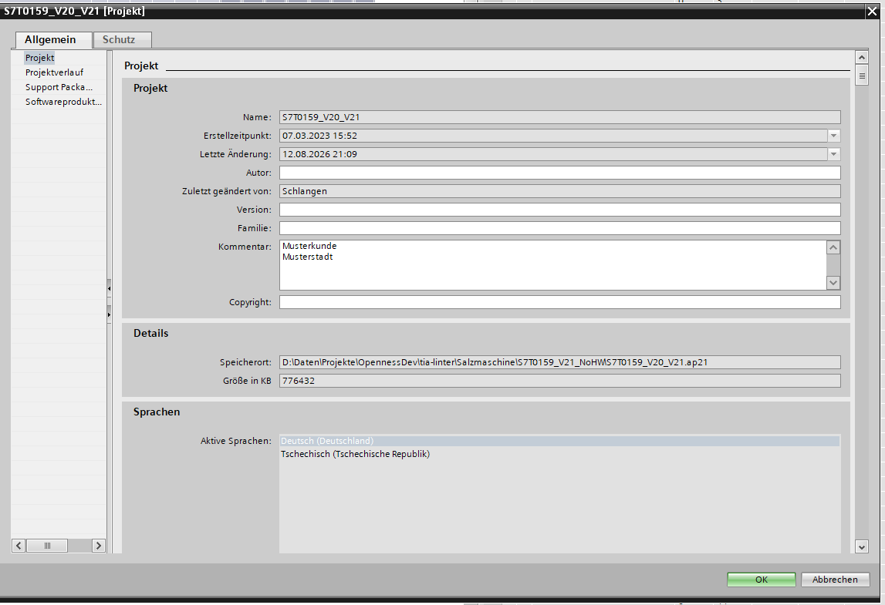

#### Prüfpunkt 19 — Kundeninformation in Projekteigenschaften

| | |
|---|---|
| **Kategorie** | Projektmetadaten |
| **Standard-Schweregrad** | Warnung |
| **Config-Schlüssel** | `checks.projektmetadaten.pflichtfelder` |

**Was wird geprüft?**
Für jedes in der Konfiguration hinterlegte Pflichtfeld wird geprüft, ob es
in den Top-Level-Projekteigenschaften ausgefüllt ist. Ist ein Feld leer,
wird ein Befund erzeugt.

**Warum ist das wichtig?**
Grundlegende Projektinformationen wie Autor oder Version sollten für jedes
Projekt gepflegt sein, damit auch nach längerer Zeit oder bei Weitergabe
klar ist, wer das Projekt erstellt hat und um welchen Stand es sich
handelt.

**Parameter**

| Parameter | Standardwert | Bedeutung |
|---|---|---|
| `felder` | `["Author", "Version"]` | Liste der zu prüfenden Projekteigenschaften-Felder. |

**Beispiel**

```
Projekt > Eigenschaften > Author
→ Pflichtfeld 'Author' ist nicht ausgefüllt.
```

**Besonderheiten**

- Wichtig bei der Konfiguration: In der Liste `felder` müssen die echten,
  **englischen** internen Attributnamen der Openness-Schnittstelle stehen
  (z. B. `Author`) — nicht die deutsche Bezeichnung ("Autor"), wie sie in
  der TIA-Portal-Oberfläche angezeigt wird. Ein falsch geschriebener
  Feldname wird stillschweigend als leer gewertet und meldet dauerhaft
  einen Befund.

**Empfehlung zur Behebung**
Pflichtfeld in den Projekteigenschaften ausfüllen.

#### Prüfpunkt 20 — Anzahl Sprachen

| | |
|---|---|
| **Kategorie** | Projektmetadaten |
| **Standard-Schweregrad** | Warnung |
| **Config-Schlüssel** | `checks.projektmetadaten.max_sprachen` |

**Was wird geprüft?**
Es wird gezählt, wie viele Sprachen im Projekt aktiv sind (also für
Kommentare, Netzwerktitel und andere Texte zur Verfügung stehen), und mit
dem konfigurierten Maximum verglichen. Wird das Maximum überschritten,
wird ein Befund mit der vollständigen Liste aller aktiven Sprachen erzeugt.

**Warum ist das wichtig?**
Zusätzliche Sprachen werden während der Entwicklung häufig testweise
aktiviert und danach nicht mehr deaktiviert. Jede zusätzliche Sprache
bedeutet doppelte Pflege aller Kommentare und Texte — bleiben nicht mehr
benötigte Sprachen aktiv, drohen sie leer oder veraltet zu bleiben.

**Parameter**

| Parameter | Standardwert | Bedeutung |
|---|---|---|
| `max` | `2` | Maximale Anzahl gleichzeitig aktiver Sprachen. |

**Beispiel**

```
Projekt > Eigenschaften > Sprachen
→ 4 aktive Sprachen konfiguriert (Schwellenwert: 2):
  Deutsch, Englisch, Französisch, Italienisch.
```

**Empfehlung zur Behebung**
Nicht mehr benötigte Sprachen aus den Projekteigenschaften entfernen.

#### Prüfpunkt 21 — Kompilierfehler und Warnungen

| | |
|---|---|
| **Kategorie** | Projektmetadaten |
| **Standard-Schweregrad** | siehe Besonderheiten — fest vorgegeben, nicht konfigurierbar |
| **Config-Schlüssel** | `checks.projektmetadaten.kompilierfehler` |

**Was wird geprüft?**
Für jede PLC-Software im Projekt wird ein vollständiger Übersetzungsvorgang
(Kompilieren) angestoßen. Jede dabei zurückgemeldete Compiler-Meldung wird
als eigener Befund aufgenommen: Meldungen mit mindestens einem Fehler
gelten als Fehler-Befund, reine Warnmeldungen als Warnung.

**Warum ist das wichtig?**
Kompilierfehler bedeuten, dass sich ein Baustein nicht in ein lauffähiges
Programm übersetzen lässt — der schwerwiegendste denkbare Verstoß, denn ein
nicht übersetzbares Programm lässt sich gar nicht erst auf die Steuerung
laden. Auch Compiler-Warnungen weisen häufig auf reale Probleme hin (z. B.
implizite Typumwandlungen), auch wenn sie die Übersetzung selbst nicht
verhindern.

**Parameter**
Dieser Prüfpunkt hat keine konfigurierbaren Parameter.

**Beispiel**

```
PLC_1 > Compiler-Meldung > FB_Motor\Netzwerk 3
→ Adressbereich überschritten.
```

**Besonderheiten**

- Für das Übersetzen müssen laut TIA-Portal-Vorgabe alle Geräte offline
  sein. Läuft die Prüfung z. B. gegen ein Projekt mit online geschalteten
  Geräten, kann bereits der Übersetzungsvorgang selbst fehlschlagen — auch
  das wird als eigener Fehler-Befund gemeldet ("Übersetzen fehlgeschlagen:
  …").
- Ähnlich wie bei [Prüfpunkt 18c](#prüfpunkt-18c-kommunikationszertifikat)
  hat der konfigurierte Standard-Schweregrad hier keine Wirkung auf
  einzelne Befunde: Ob ein Befund als Fehler oder als Warnung erscheint,
  hängt ausschließlich davon ab, ob der Compiler dazu mindestens einen
  Fehler oder nur Warnungen zurückgemeldet hat.

**Empfehlung zur Behebung**
Compiler-Meldung beheben und Baustein neu übersetzen.

#### Prüfpunkt 22 — Projektversion vorhanden

| | |
|---|---|
| **Kategorie** | Projektmetadaten |
| **Standard-Schweregrad** | Warnung |
| **Config-Schlüssel** | `checks.projektmetadaten.projektversion` |

**Was wird geprüft?**
Es wird geprüft, ob für das Projekt insgesamt eine Versionsnummer
hinterlegt ist. Fehlt sie, wird ein Befund erzeugt.

**Warum ist das wichtig?**
Eine Projektversion ermöglicht es, verschiedene Bearbeitungsstände eindeutig
zu unterscheiden — etwa bei der Übergabe an einen Kunden oder beim
Vergleich mit einer älteren Sicherungskopie.

**Parameter**
Dieser Prüfpunkt hat keine konfigurierbaren Parameter.

**Beispiel**

```
Projekt > Eigenschaften > Version
→ Projekt hat keine Versionsnummer hinterlegt.
```

**Besonderheiten**

- Dieser Prüfpunkt betrifft die Versionsnummer des **Gesamtprojekts**
  (Projekteigenschaft "Version") — nicht zu verwechseln mit der
  Versionsangabe im Kopf einzelner Bausteine aus
  [Prüfpunkt 4](#prüfpunkt-4-bausteinköpfe-ohne-änderungshistorie).

**Empfehlung zur Behebung**
Versionsnummer (z. B. 1.2.3) in den Projekteigenschaften vergeben.

---

### 10.6 Bibliotheken & Typen (Prüfpunkte 23-24)

Diese Kategorie prüft den Umgang mit Bibliotheken und wiederverwendeten
Typinstanzen: Sind eingesetzte Bibliotheksbausteine noch auf dem aktuellen
Stand, und gibt es "verwaiste" Datenbausteine, deren zugehöriger
Funktionsbaustein nicht mehr existiert?

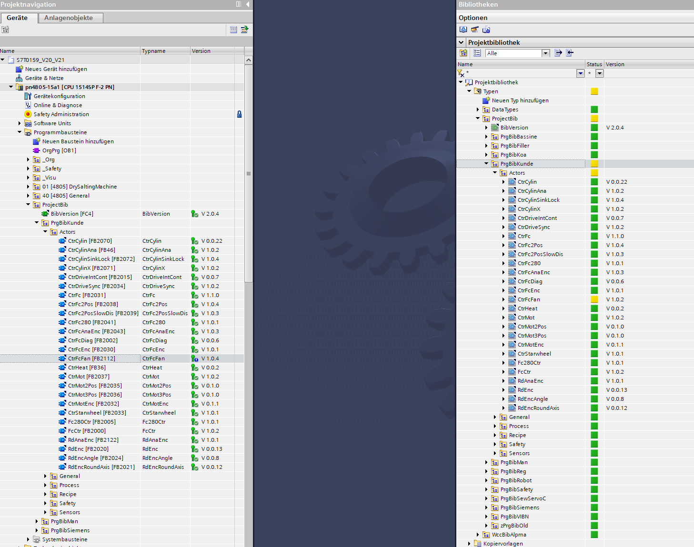

#### Prüfpunkt 23 — Bibliotheksbausteine auf aktuellem Stand

| | |
|---|---|
| **Kategorie** | Bibliotheken & Typen |
| **Standard-Schweregrad** | Warnung |
| **Config-Schlüssel** | `checks.bibliotheken.veraltete_bibliotheken` |

**Was wird geprüft?**
Für die Projektbibliothek wird ein Aktualitätscheck durchgeführt: Für jeden
aus der Bibliothek abgeleiteten Typ (z. B. einen Baustein oder Datentyp,
der auf einem Bibliothekstyp basiert) wird geprüft, ob die im Projekt
verwendete Instanz noch der aktuellen Version des Bibliothekstyps
entspricht. Jede veraltete Instanz wird als eigener Befund gemeldet.

**Warum ist das wichtig?**
Wird ein Bibliothekstyp weiterentwickelt — etwa weil ein Fehler behoben
oder eine Funktion ergänzt wurde —, wirkt sich das nur dann auf das Projekt
aus, wenn die verwendeten Instanzen auch tatsächlich aktualisiert werden.
Veraltete Instanzen laufen unbemerkt mit dem alten, womöglich fehlerhaften
Stand weiter.

**Parameter**
Dieser Prüfpunkt hat keine konfigurierbaren Parameter.

**Beispiel**

```
Projektbibliothek
→ Typinstanz 'FB_Ventil' ist veraltet (aktuelle Bibliotheksversion: 2.1).
```

**Besonderheiten**

- Dieser Prüfpunkt deckt ausschließlich die **Projektbibliothek** ab (die
  im Projekt selbst gespeicherte Bibliothek). Globale Bibliotheken, die
  z. B. zentral im Netzwerk liegen und von mehreren Projekten gemeinsam
  genutzt werden, werden derzeit nicht geprüft.

**Empfehlung zur Behebung**
Bibliothekstyp in der Projektbibliothek aktualisieren und betroffene
Instanzen neu generieren.

#### Prüfpunkt 24 — Instanz-DBs ohne zugehörigen FB

| | |
|---|---|
| **Kategorie** | Bibliotheken & Typen |
| **Standard-Schweregrad** | Fehler |
| **Config-Schlüssel** | `checks.bibliotheken.verwaiste_instanz_dbs` |

**Was wird geprüft?**
Für jeden Instanz-Datenbaustein (den einem konkreten Funktionsbaustein-
Aufruf zugeordneten DB) wird geprüft, ob der zugehörige Funktionsbaustein
(FB) noch im Projekt existiert. Ist der FB nicht mehr vorhanden, wird ein
Befund erzeugt.

**Warum ist das wichtig?**
Ein Instanz-DB ohne zugehörigen FB ("verwaist") ist funktionslos — er kann
nicht mehr korrekt genutzt werden, belegt aber weiterhin Platz im Projekt
und kann bei einer Sichtprüfung fälschlich für aktive Logik gehalten
werden. Dieser Zustand entsteht meist, wenn ein FB gelöscht oder umbenannt
wurde, ohne die zugehörigen Instanz-DBs zu bereinigen.

**Parameter**
Dieser Prüfpunkt hat keine konfigurierbaren Parameter.

**Beispiel**

```
PLC_1 > Datenbaustein > DB_Ventil_Instanz
→ Instanz-DB 'DB_Ventil_Instanz' referenziert FB 'FB_Ventil_Alt',
  der nicht mehr im Projekt existiert.
```

**Empfehlung zur Behebung**
Verwaisten Instanz-DB entfernen oder den zugehörigen FB wiederherstellen.

---

### 10.7 Siemens Styleguide & Best Practices (Prüfpunkte 25-35)

Diese letzte und umfangreichste Kategorie fasst Empfehlungen aus dem
Siemens Standardisierungsleitfaden sowie allgemein anerkannte
Best Practices der SPS-Programmierung zusammen. Sie deckt ein breites
Spektrum ab — von der sauberen Kapselung interner Bausteindaten über die
Vermeidung unnötiger Instanz-Datenbausteine bis zur Projektorganisation.

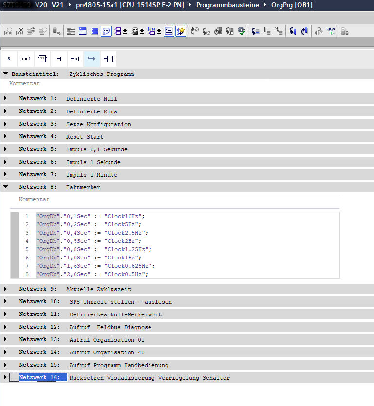

#### Prüfpunkt 25 — Sprachen konsistent

| | |
|---|---|
| **Kategorie** | Siemens Styleguide & Best Practices |
| **Standard-Schweregrad** | Warnung |
| **Config-Schlüssel** | `checks.styleguide.sprachen_konsistent` |

**Was wird geprüft?**
Es wird geprüft, ob die im Projekt hinterlegte Referenzsprache (die
Sprache, in der Kommentare und Texte primär verfasst werden sollen) der
konfigurierten Erwartungssprache entspricht.

**Warum ist das wichtig?**
Wechselt die Referenzsprache unbemerkt — etwa weil beim Anlegen des
Projekts versehentlich Englisch statt Deutsch gewählt wurde —, kann das
dazu führen, dass neue Kommentare in der "falschen" Sprache erfasst
werden, ohne dass es sofort auffällt.

**Parameter**

| Parameter | Standardwert | Bedeutung |
|---|---|---|
| `erwartete_sprache` | `de` | Sprachkürzel, dem die Referenzsprache des Projekts entsprechen soll. |

**Beispiel**

```
Projekt > Eigenschaften > Sprache
→ Referenzsprache des Projekts ('en-US') weicht von 'de' ab.
```

**Besonderheiten**

- Dieser Prüfpunkt ist bewusst vereinfacht: Er prüft die **projektweite**
  Referenzsprache, nicht die tatsächlich in jedem einzelnen Kommentar oder
  Netzwerktitel verwendete Sprache — das würde eine echte Spracherkennung
  pro Text erfordern und ist nicht Teil dieses Prüfpunkts.

**Empfehlung zur Behebung**
Kommentare und Netzwerktitel einheitlich in der Projektsprache verfassen
bzw. die Referenzsprache im Projekt korrigieren.

#### Prüfpunkt 26 — Direkter Zugriff auf Static-Tags von außen

| | |
|---|---|
| **Kategorie** | Siemens Styleguide & Best Practices |
| **Standard-Schweregrad** | Warnung |
| **Config-Schlüssel** | `checks.styleguide.static_zugriff_extern` |

**Was wird geprüft?**
Für jeden Instanz-Datenbaustein wird geprüft, ob eine seiner
"Static"-Variablen (interne, dauerhaft gespeicherte Variablen des
zugehörigen Funktionsbausteins) von einer anderen Stelle im Projekt als
dem Funktionsbaustein selbst direkt gelesen oder beschrieben wird.

**Warum ist das wichtig?**
Static-Variablen sind als interner Zustand eines Funktionsbausteins
gedacht — der vorgesehene Weg, mit einem FB zu kommunizieren, führt über
seine Ein- und Ausgangsparameter. Greift Code von außen direkt auf den
Instanz-DB zu, umgeht das diese Schnittstelle und macht den Baustein
schwerer wartbar: Änderungen an seiner internen Struktur können dann
unerwartet andere Stellen im Programm beeinflussen.

**Parameter**
Dieser Prüfpunkt hat keine konfigurierbaren Parameter.

**Beispiel**

```
PLC_1 > Datenbaustein > DB_Ventil_Instanz > Member > InternerZaehler
→ Static-Tag 'InternerZaehler' wird von außerhalb ('FC_Diagnose')
  direkt zugegriffen.
```

**Besonderheiten**

- Dieser Prüfpunkt beruht teilweise auf einer nicht vollständig durch die
  Openness-Referenzdokumentation belegten Annahme darüber, welche
  Eigenschaft den Namen des zugreifenden Bausteins trägt — er kann daher
  in Einzelfällen ungenau sein.

**Empfehlung zur Behebung**
Zugriff über Ein-/Ausgangsparameter des FB kapseln, statt direkt auf den
Instanz-DB zuzugreifen.

#### Prüfpunkt 27 — Output-Tag pro Zyklus nur einmal beschrieben

| | |
|---|---|
| **Kategorie** | Siemens Styleguide & Best Practices |
| **Standard-Schweregrad** | Fehler |
| **Config-Schlüssel** | `checks.styleguide.output_mehrfach_beschrieben` |

**Was wird geprüft?**
Für jeden VAR_OUTPUT-Parameter eines Funktionsbausteins oder einer
Funktion wird gezählt, an wie vielen Stellen **innerhalb** des Bausteins er
beschrieben wird. Wird er an mehr als einer Stelle beschrieben, wird ein
Befund erzeugt.

**Warum ist das wichtig?**
Analog zu [Prüfpunkt 13](#prüfpunkt-13-ausgänge-maximal-einmal-geschrieben)
bei Ausgangs-Tags führt das mehrfache Beschreiben desselben
Output-Parameters innerhalb eines Bausteins zu unvorhersehbarem Verhalten,
das von der internen Ausführungsreihenfolge abhängt.

**Parameter**
Dieser Prüfpunkt hat keine konfigurierbaren Parameter.

**Beispiel**

```
PLC_1 > Programmbausteine > FB_Regler > Fehlercode
→ Output-Parameter 'Fehlercode' wird an 2 Stellen beschrieben.
```

**Besonderheiten**

- Der Standard-Schweregrad ist hier **Fehler** statt Warnung — wie beim
  eng verwandten Prüfpunkt 13.

**Empfehlung zur Behebung**
Schreibzugriffe auf den Output-Parameter auf eine Stelle im Baustein
konsolidieren.

#### Prüfpunkt 28 — Multi-Instanzen statt Einzel-Instanzen

| | |
|---|---|
| **Kategorie** | Siemens Styleguide & Best Practices |
| **Standard-Schweregrad** | Warnung |
| **Config-Schlüssel** | `checks.styleguide.multi_instanzen` |

**Was wird geprüft?**
Für jeden Instanz-Datenbaustein wird geprüft, ob er einen bekannten
Standard-Timer oder -Zähler (z. B. TON, TOF, CTU, IEC_Timer) als
eigenständigen Einzel-Instanz-DB aufruft, statt ihn als Multi-Instanz
innerhalb des aufrufenden Bausteins zu führen.

**Warum ist das wichtig?**
Jeder Einzel-Instanz-DB ist ein eigenständiges Objekt im Projekt, das
Speicher belegt und die Bausteinliste unnötig aufbläht. Bei Timern und
Zählern, die typischerweise nur innerhalb eines einzigen aufrufenden
Bausteins gebraucht werden, ist eine Multi-Instanz — die als Teil des
Instanz-DBs des aufrufenden Bausteins mitgeführt wird — meist die sauberere
und ressourcenschonendere Lösung.

**Parameter**
Dieser Prüfpunkt hat keine konfigurierbaren Parameter in der
Konfigurationsdatei — die erkannten Timer-/Zähler-Bausteintypen sind fest
im Programmcode hinterlegt.

**Beispiel**

```
PLC_1 > Datenbaustein > TON_Instanz_3
→ Instanz-DB 'TON_Instanz_3' für 'TON' — als Multi-Instanz statt
  Einzel-Instanz-DB anlegen.
```

**Besonderheiten**

- Dieser Prüfpunkt arbeitet mit einer festen Liste bekannter
  Siemens-/IEC-Standardbausteine (u. a. `TON`, `TOF`, `TP`, `TONR`, `CTU`,
  `CTD`, `CTUD`, `IEC_Timer`, `IEC_Counter`, `S_ODT`, `S_OFFDT`,
  `S_PULSE`). Eigene, kundenspezifische Funktionsbausteine, die ebenfalls
  besser als Multi-Instanz aufgerufen würden, werden von diesem Prüfpunkt
  nicht erkannt.

**Empfehlung zur Behebung**
Aufruf auf Multi-Instanz umstellen (spart Bausteine und Datenbausteine).

#### Prüfpunkt 29 — UDT für wiederkehrende Strukturen

| | |
|---|---|
| **Kategorie** | Siemens Styleguide & Best Practices |
| **Standard-Schweregrad** | Warnung |
| **Config-Schlüssel** | `checks.styleguide.udt_wiederkehrende_strukturen` |

**Was wird geprüft?**
Für alle Datenbausteine wird die jeweilige Struktur (die Liste aller
Variablennamen mit ihrem Datentyp) verglichen. Kommt exakt dieselbe
Struktur in mindestens zwei verschiedenen Datenbausteinen vor, ohne dass
sie als eigener PLC-Datentyp (UDT) ausgelagert ist, wird für jeden
betroffenen DB ein Befund erzeugt.

**Warum ist das wichtig?**
Kommt dieselbe Datenstruktur mehrfach unabhängig voneinander vor, muss bei
einer notwendigen Änderung (z. B. ein zusätzliches Feld) jede einzelne
Fundstelle manuell angepasst werden — vergisst man dabei eine Stelle,
laufen die Strukturen unbemerkt auseinander. Ein gemeinsamer PLC-Datentyp
(UDT) muss dagegen nur an einer Stelle geändert werden.

**Parameter**
Dieser Prüfpunkt hat keine konfigurierbaren Parameter.

**Beispiel**

```
PLC_1 > Datenbaustein > DB_Rezept_A
→ Struktur von 'DB_Rezept_A' ist identisch zu 2 weiteren DBs
  (DB_Rezept_B, DB_Rezept_C) — als UDT auslagern.
```

**Besonderheiten**

- Datenbausteine mit weniger als zwei Variablen gelten als zu trivial, um
  als "wiederkehrende Struktur" gezählt zu werden, und werden von diesem
  Prüfpunkt automatisch ausgenommen.

**Empfehlung zur Behebung**
Wiederkehrende Struktur als PLC-Datentyp (UDT) anlegen und in den
betroffenen Datenbausteinen referenzieren.

#### Prüfpunkt 30 — OB1 (Main) Komplexität

| | |
|---|---|
| **Kategorie** | Siemens Styleguide & Best Practices |
| **Standard-Schweregrad** | Warnung |
| **Config-Schlüssel** | `checks.styleguide.ob1_komplexitaet` |

**Was wird geprüft?**
Für den zyklischen Hauptorganisationsbaustein OB1 wird gezählt, wie viele
seiner Netzwerke eigene Logik enthalten (also mehr als nur einen einzelnen
Bausteinaufruf). Übersteigt diese Zahl den konfigurierten Schwellenwert,
wird ein Befund erzeugt.

**Warum ist das wichtig?**
OB1 sollte idealerweise als reine "Aufrufzentrale" dienen, die andere
Bausteine in der richtigen Reihenfolge aufruft. Enthält OB1 selbst viel
eigene Logik, wird er unübersichtlich, und die eigentliche
Programmstruktur ist schwerer zu erkennen.

**Parameter**

| Parameter | Standardwert | Bedeutung |
|---|---|---|
| `max_netzwerke_mit_logik` | `5` | Maximale Anzahl an Netzwerken mit eigener Logik in OB1. |

**Beispiel**

```
PLC_1 > Programmbausteine > Main [OB1]
→ OB1 enthält 8 Netzwerke mit eigener Logik (Schwellenwert: 5) —
  Logik in eigene Bausteine auslagern.
```

**Besonderheiten**

- Ein Netzwerk, das nur einen einzigen Bausteinaufruf enthält (also nur den
  Aufruf selbst, ohne zusätzliche Verknüpfungen), zählt **nicht** als
  "eigene Logik" — reine Aufrufnetzwerke wirken sich also nicht negativ auf
  diesen Prüfpunkt aus.

**Empfehlung zur Behebung**
Logik aus OB1 in eigene Bausteine auslagern — OB1 sollte primär Bausteine
aufrufen.

#### Prüfpunkt 31 — Know-How-Schutz dokumentiert

| | |
|---|---|
| **Kategorie** | Siemens Styleguide & Best Practices |
| **Standard-Schweregrad** | Warnung |
| **Config-Schlüssel** | `checks.styleguide.know_how_schutz` |

**Was wird geprüft?**
Für jeden Baustein mit aktiviertem Know-how-Schutz (Kopierschutz, der den
Bausteininhalt vor dem Einsehen durch Dritte schützt) wird geprüft, ob die
Kopfbeschreibung einen entsprechenden Hinweis enthält (die Wörter
"know-how" oder "knowhow"). Fehlt dieser Hinweis, wird ein Befund erzeugt.

**Warum ist das wichtig?**
Ein know-how-geschützter Baustein lässt sich von außen nicht einsehen —
ohne einen Hinweis in der Kopfbeschreibung ist auf den ersten Blick nicht
erkennbar, dass es sich überhaupt um einen geschützten Baustein handelt,
was bei der Fehlersuche oder Projektübergabe zu Verwirrung führen kann.

**Parameter**
Dieser Prüfpunkt hat keine konfigurierbaren Parameter.

**Beispiel**

```
PLC_1 > Programmbausteine > FB_Rezeptalgorithmus
→ Baustein 'FB_Rezeptalgorithmus' ist know-how-geschützt, aber nicht
  als solcher dokumentiert.
```

**Besonderheiten**

- Die Prüfung auf den Dokumentationshinweis erfolgt als einfache
  Textsuche in der Kopfbeschreibung (unabhängig von Groß-/Kleinschreibung)
  — eine andere Formulierung als "know-how" bzw. "knowhow" wird nicht
  erkannt.

**Empfehlung zur Behebung**
Know-how-Schutz im Bausteinkopf bzw. in der Projektdokumentation
vermerken.

#### Prüfpunkt 32 — Tag-Tabellen nur I/O-Tags

| | |
|---|---|
| **Kategorie** | Siemens Styleguide & Best Practices |
| **Standard-Schweregrad** | Warnung |
| **Config-Schlüssel** | `checks.styleguide.tag_tabellen_nur_io` |

**Was wird geprüft?**
Für jede Variablentabelle wird geprüft, ob sie sowohl echte I/O-Tags (mit
Peripherie-Adresse, siehe [Prüfpunkt 6](#prüfpunkt-6-plc-tag-namenskonvention-eingängeausgänge))
als auch andere Tags (z. B. interne Merker ohne Adresse) enthält. Ist das
der Fall, wird ein Befund für die gesamte Tabelle erzeugt.

**Warum ist das wichtig?**
Werden I/O-Tags und interne Merker in derselben Tabelle vermischt, ist auf
einen Blick schwerer erkennbar, welche Signale tatsächlich mit der
physischen Anlage verbunden sind und welche rein programmintern sind.

**Parameter**
Dieser Prüfpunkt hat keine konfigurierbaren Parameter.

**Beispiel**

```
PLC_1 > Variablentabellen > Tags_Allgemein
→ Tag-Tabelle 'Tags_Allgemein' enthält sowohl I/O-Tags als auch
  andere Tags — in getrennte Tabellen aufteilen.
```

**Besonderheiten**

- Leere Variablentabellen werden von diesem Prüfpunkt automatisch
  übersprungen.

**Empfehlung zur Behebung**
Nicht-I/O-Tags (z. B. Merker) in eine eigene Tag-Tabelle verschieben.

#### Prüfpunkt 33 — Nicht-optimierte Bausteine

| | |
|---|---|
| **Kategorie** | Siemens Styleguide & Best Practices |
| **Standard-Schweregrad** | Warnung |
| **Config-Schlüssel** | `checks.styleguide.nicht_optimierte_bausteine` |

**Was wird geprüft?**
Für jeden Baustein wird geprüft, ob er mit "Standard"-Bausteinzugriff
(statt "Optimiert") projektiert ist. Ist das der Fall, wird ein Befund
erzeugt.

**Warum ist das wichtig?**
Optimierter Bausteinzugriff ist bei modernen S7-1200/1500-Steuerungen der
empfohlene Standard: TIA Portal verwaltet dabei die Adressierung der
Variablen automatisch, was Adressierungsfehler ausschließt und in der
Regel performanter ist. Standard-Zugriff mit fester, manuell vergebener
Adressierung gilt heute meist nur noch aus Kompatibilitätsgründen als
notwendig.

**Parameter**
Dieser Prüfpunkt hat keine konfigurierbaren Parameter.

**Beispiel**

```
PLC_1 > Programmbausteine > DB_Altsystem
→ Baustein 'DB_Altsystem' ist nicht optimiert (MemoryLayout = Standard).
```

**Besonderheiten**

- Es gibt durchaus legitime technische Gründe für Standard-Zugriff (z. B.
  bestimmte Kommunikationsbausteine oder ältere Steuerungsfamilien) — ein
  Befund bei diesem Prüfpunkt ist als Hinweis zum Prüfen zu verstehen,
  nicht automatisch als Fehler.

**Empfehlung zur Behebung**
Bausteinzugriff auf "Optimiert" umstellen, sofern kein technischer Grund
dagegenspricht.

#### Prüfpunkt 34 — Bausteine im Root ohne Ordnerstruktur

| | |
|---|---|
| **Kategorie** | Siemens Styleguide & Best Practices |
| **Standard-Schweregrad** | Warnung |
| **Config-Schlüssel** | `checks.styleguide.bausteine_im_root` |

**Was wird geprüft?**
Es wird gezählt, wie viele Bausteine direkt im Wurzelordner der
Programmbausteine liegen (also nicht in einem Unterordner gruppiert sind),
und mit dem konfigurierten Schwellenwert verglichen. Wird er überschritten,
wird ein Befund erzeugt.

**Warum ist das wichtig?**
Liegen sehr viele Bausteine unstrukturiert direkt im Wurzelordner, wird
die Navigation im Projekt zunehmend unübersichtlich — eine thematische
Gruppierung in Unterordner (z. B. nach Anlagenteil oder Funktion)
erleichtert das Wiederfinden erheblich.

**Parameter**

| Parameter | Standardwert | Bedeutung |
|---|---|---|
| `max_bausteine_root` | `20` | Maximale Anzahl an Bausteinen direkt im Wurzelordner. |

**Beispiel**

```
PLC_1 > Programmbausteine
→ 34 Bausteine liegen direkt im Root-Ordner (Schwellenwert: 20) —
  in Unterordner gruppieren.
```

**Empfehlung zur Behebung**
Bausteine in thematische Unterordner/Gruppen einsortieren.

#### Prüfpunkt 35 — Schreibschutz von Bausteinen

| | |
|---|---|
| **Kategorie** | Siemens Styleguide & Best Practices |
| **Standard-Schweregrad** | Warnung |
| **Config-Schlüssel** | `checks.styleguide.schreibschutz` |

**Was wird geprüft?**
Für jeden Baustein mit aktiviertem Schreibschutz wird geprüft, ob die
Kopfbeschreibung einen entsprechenden Hinweis enthält (die Begriffe
"schreibschutz" oder "write-protect"). Fehlt dieser Hinweis, wird ein
Befund erzeugt.

**Warum ist das wichtig?**
Analog zu [Prüfpunkt 31](#prüfpunkt-31-know-how-schutz-dokumentiert) lässt
sich ein schreibgeschützter Baustein zwar weiterhin einsehen, aber nicht
mehr verändern. Ohne Dokumentationshinweis ist nicht sofort erkennbar,
dass Änderungsversuche am Baustein absichtlich blockiert sind, was bei
einer geplanten Anpassung zunächst für Verwirrung sorgen kann.

**Parameter**
Dieser Prüfpunkt hat keine konfigurierbaren Parameter.

**Beispiel**

```
PLC_1 > Programmbausteine > FB_Kalibrierung
→ Baustein 'FB_Kalibrierung' ist schreibgeschützt, aber nicht
  entsprechend dokumentiert.
```

**Besonderheiten**

- Dieser Prüfpunkt ist **neu in TIA Portal V21** — das zugrunde liegende
  Attribut (`IsWriteProtected`) ist erst seit dieser Version über die
  Openness-Schnittstelle verlässlich auslesbar.

**Empfehlung zur Behebung**
Schreibschutz im Bausteinkopf bzw. in der Projektdokumentation vermerken.

---

> **Kapitel 10 ist damit vollständig:** Alle 35 ursprünglichen Prüfpunkte
> (inkl. der Unterpunkte 11b, 18b und 18c) sind ausgearbeitet — ergänzt um
> Prüfpunkt 1b (UDT ohne Kommentar) und Prüfpunkt 12b (Eingänge dürfen nicht
> beschrieben werden), die beide nachträglich als sinnvolle Ergänzung
> hinzugekommen sind (siehe Änderungshistorie in Anhang C). Rückmeldungen
> und Korrekturen sind jederzeit willkommen — dieses Handbuch bleibt bis zu
> einer ersten Durchsicht als Entwurf gekennzeichnet (siehe Kopf des
> Dokuments).

---

<div style="page-break-after: always;"></div>

## Anhang A: Glossar

| Begriff | Erklärung |
|---|---|
| **TIA Portal** | Engineering-Software von Siemens zur Projektierung von SPS-Steuerungen. |
| **TIA Portal Openness API** | Programmierschnittstelle von Siemens, über die externe Programme wie der TIA Linter lesend (und grundsätzlich auch schreibend) auf TIA-Portal-Projekte zugreifen können. |
| **Baustein** | Sammelbegriff für die Programmeinheiten eines SPS-Programms (z. B. Funktionsbaustein FB, Funktion FC, Organisationsbaustein OB). |
| **DB (Datenbaustein)** | Baustein, der ausschließlich Daten (Variablen) speichert, keine Programmlogik. |
| **PLC-Tag** | Eine benannte, projektweit gültige Variable, meist mit Bezug zu einem Ein- oder Ausgang der Steuerung. |
| **Netzwerk** | Ein logischer Programmierabschnitt innerhalb eines Bausteins. |
| **Variablentabelle** | Eine Sammlung von PLC-Tags, meist thematisch gruppiert (z. B. Eingänge, Ausgänge). |
| **Headless** | Betrieb eines Programms ohne sichtbare Benutzeroberfläche im Hintergrund — hier: Zugriff auf TIA Portal, ohne dass sich das TIA-Portal-Fenster öffnet. |

---

<div style="page-break-after: always;"></div>

## Anhang B: Aus diesem Handbuch ein PDF erstellen

Dieses Handbuch liegt als reine Markdown-Datei (`Handbuch.md`) vor und wurde
bewusst so geschrieben, dass sich daraus ohne Nacharbeit ein sauberes PDF
erzeugen lässt: einfache Überschriften, einfache Tabellen, Bilder über
Standard-Markdown-Syntax. Die einzige Ausnahme sind die unsichtbaren
Seitenumbruch-Marker vor jedem Kapitel (siehe unten) — reines HTML, das in
jeder normalen Markdown-Ansicht ohnehin nicht sichtbar ist.

**Bilder ergänzen**

An vielen Stellen im Handbuch steht bereits ein Bild-Platzhalter in der Form
``. Um ein solches Bild einzufügen:

1. Screenshot bzw. Grafik als `.png` speichern, mit demselben Dateinamen,
   der im Platzhalter steht (z. B. `gui-eingabeseite-gesamt.png`).
2. Die Datei in den Ordner `docs/images/` legen — also **neben** die Datei
   `Handbuch.md`, nicht in einen weiteren Unterordner.
3. Sobald die Datei dort liegt, wird sie beim nächsten PDF-Export (siehe
   unten) automatisch mit eingebunden — an der Markdown-Datei selbst muss
   nichts mehr geändert werden.

> Bis ein Bild tatsächlich vorhanden ist, zeigen die meisten
> Markdown-Ansichten (auch diese Vorschau) an der jeweiligen Stelle nur den
> Beschreibungstext oder ein Platzhalter-Symbol an — das ist normal und
> kein Fehler.

**Seitenumbrüche**

Vor jedem Kapitel (`##`-Überschrift, also Kapitel 1–10 sowie Anhang A–C)
steht im Quelltext eine unsichtbare Zeile:

```html
<div style="page-break-after: always;"></div>
```

Das ist reines HTML und in normalen Markdown-Ansichten (Obsidian, GitHub,
VS-Code-Vorschau) unsichtbar — es verändert also nichts am Lesefluss am
Bildschirm. Markdown selbst kennt keinen eigenen Befehl für
Seitenumbrüche; dieses HTML-Snippet ist der gebräuchlichste Ersatz dafür.

> **Wichtig:** Dieser Marker funktioniert zuverlässig mit **Variante 1**
> unten (VS Code, Chrome-basiert) — dort beginnt jedes Kapitel auf einer
> neuen PDF-Seite. Bei **Variante 2** (Pandoc) wird er dagegen in der
> Standardeinstellung stillschweigend **ignoriert** (kein Fehler, aber
> auch kein Umbruch), da Pandoc PDFs standardmäßig über LaTeX erzeugt und
> LaTeX rohes HTML nicht auswertet. Wer feste Seitenumbrüche über Pandoc
> braucht, müsste stattdessen an jeder Stelle einen rohen LaTeX-Block
> (```` ```{=latex} ````/`\newpage`/```` ``` ````) einfügen — das wiederum
> würde in VS Code/Obsidian/GitHub als sichtbarer Codeblock erscheinen.
> Beide Mechanismen gleichzeitig zu pflegen war für dieses Handbuch nicht
> vorgesehen; falls du überwiegend über Pandoc exportierst, sag Bescheid.

Es gibt mehrere gleichwertige Wege, aus der Datei ein PDF zu erzeugen —
hier die zwei einfachsten:

**Variante 1 — Visual Studio Code (am einfachsten, keine Kommandozeile nötig)**

1. Visual Studio Code öffnen und die Erweiterung **"Markdown PDF"** (von
   yzane) installieren.
2. Die Datei `Handbuch.md` in VS Code öffnen.
3. Rechtsklick im Dokument → **"Markdown PDF: Export (pdf)"**.
4. Das PDF wird automatisch im selben Ordner wie die Markdown-Datei
   erzeugt.

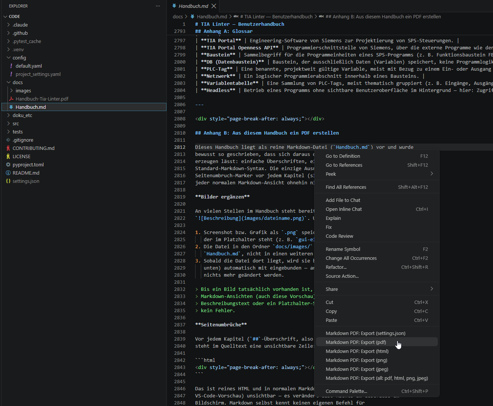

**Variante 2 — Pandoc (Kommandozeile, für technisch versierte Nutzer)**

Mit installiertem [Pandoc](https://pandoc.org) genügt im Ordner mit der
Datei folgender Befehl:

```bash
pandoc Handbuch.md -o Handbuch.pdf --toc -V lang=de
```

Die Option `--toc` erzeugt dabei automatisch ein anklickbares, mit
Seitenzahlen versehenes Inhaltsverzeichnis am Anfang des PDFs — zusätzlich
zu der Übersicht, die bereits am Anfang der Markdown-Datei steht.

> Beide Varianten erzeugen aus derselben Datei ein vollständiges PDF,
> **inklusive** aller Bilder, die zu diesem Zeitpunkt bereits unter
> `docs/images/` liegen. Wird das Handbuch später um weitere Kapitel oder
> Bilder ergänzt, müssen diese Schritte einfach nur erneut ausgeführt
> werden.

---

<div style="page-break-after: always;"></div>

## Anhang C: Änderungshistorie dieses Handbuchs

| Version | Datum | Änderung |
|---|---|---|
| 0.1 | 17.07.2026 | Ersteinrichtung: Programmübersicht, Voraussetzungen, Grundprinzip der Prüfung, vollständige Bedienungsanleitung der Oberfläche, PDF-Report, Pfad-Format, Log-Datei, Glossar. Kapitel 10 ("Die Prüfpunkte im Detail") ist als Platzhalter angelegt und noch nicht ausgefüllt. |
| 0.2 | 17.07.2026 | Kapitel 10 begonnen: Abschnitt 10.1 "Kommentare & Beschreibungen" (Prüfpunkte 1–4) vollständig ausgearbeitet, inkl. Parametern, Beispielen und Besonderheiten. Übersichtstabelle für den Bearbeitungsstand von Kapitel 10 ergänzt. |
| 0.3 | 17.07.2026 | Abschnitt 10.2 "Namenskonventionen" (Prüfpunkte 5–9) ausgearbeitet, inkl. der beiden geteilten Prüfpunkte 6 (Eingänge/Ausgänge) und 7 (FB/FC). |
| 0.4 | 17.07.2026 | Abschnitt 10.3 "Programmstruktur" (Prüfpunkte 10–16, inkl. 11b "Unbenutzte Bausteine") ausgearbeitet. |
| 0.5 | 17.07.2026 | Abschnitt 10.4 "Hardware & Konfiguration" (Prüfpunkte 17–18c) ausgearbeitet, inkl. Hinweis auf die Sonderrolle von Prüfpunkt 18c (fest vorgegebener Status statt konfigurierbarem Schweregrad, einziger Prüfpunkt mit explizitem OK-Befund). |
| 0.6 | 17.07.2026 | Abschnitt 10.5 "Projektmetadaten" (Prüfpunkte 19–22) ausgearbeitet, inkl. Hinweis auf englische vs. deutsche Feldnamen bei Prüfpunkt 19 und die Sonderrolle von Prüfpunkt 21 (Status abhängig vom Compiler-Ergebnis statt konfigurierbarem Schweregrad). |
| 0.7 | 17.07.2026 | Abschnitt 10.6 "Bibliotheken & Typen" (Prüfpunkte 23–24) ausgearbeitet. |
| 0.8 | 17.07.2026 | Abschnitt 10.7 "Siemens Styleguide & Best Practices" (Prüfpunkte 25–35) ausgearbeitet. Damit ist Kapitel 10 mit allen 35 Prüfpunkten vollständig — das Handbuch trägt bis zu einer ersten Durchsicht weiterhin die Kennzeichnung "Entwurf". |
| 0.9 | 17.07.2026 | Über 20 Bild-Platzhalter (``) an allen Stellen ergänzt, an denen ein Screenshot oder eine Grafik sinnvoll ist (GUI-Seiten, PDF-Report-Beispiele, Pfad-Format, Log-Datei, je ein Beispielbild pro Prüfpunkt-Kategorie in Kapitel 10). Ordner `docs/images/` samt README für die Bilddateien angelegt; Anhang B um eine Anleitung zum Ergänzen der Bilder erweitert. |
| 0.10 | 17.07.2026 | Abschnitt 5.2 um die neue Programmerweiterung `ausgeschlossene_ordner` ergänzt (Ordner samt Unterordnern von der Prüfung ausnehmen, z. B. bereits geprüfte Bibliotheksordner). |
| 0.11 | 17.07.2026 | Seitenumbruch-Marker (`<div style="page-break-after: always;">`) vor allen 14 Kapitel-/Anhang-Überschriften ergänzt, damit jedes Kapitel im PDF auf einer neuen Seite beginnt. In Anhang B dokumentiert, inkl. Hinweis, dass der Marker nur mit Variante 1 (VS Code) zuverlässig funktioniert und bei Variante 2 (Pandoc/LaTeX) standardmäßig folgenlos ignoriert wird. |
| 0.12 | 17.07.2026 | Prüfpunkt 5 (DB-Namensformat) in Abschnitt 10.2 an die Programmerweiterung angepasst: jetzt als zwei unabhängig konfigurierbare Einträge für Global-/Array-DB und Instanz-DB beschrieben (analog zu Prüfpunkt 6/7), inkl. Hinweis zur Einordnung von Array-DBs. |
| 0.13 | 17.07.2026 | Abschnitt 5.2 um die neue Programmerweiterung `ausgeschlossene_bausteine` ergänzt (einzelne Bausteine per Name komplett von jedem Prüfpunkt ausnehmen, unabhängig vom Ordner — Ergänzung zu `ausgeschlossene_ordner`). |
| 0.14 | 17.07.2026 | Neuen Prüfpunkt 12b ("Eingänge dürfen nicht beschrieben werden") in Abschnitt 10.3 ergänzt — schließt eine Lücke in der ursprünglichen Prüfpunkte-Liste, Standard-Schweregrad Fehler. Querverweis bei Prüfpunkt 12 ergänzt, Abschlusshinweis am Ende von Kapitel 10 aktualisiert. |
| 0.15 | 18.07.2026 | Neuen Prüfpunkt 1b ("UDT ohne Kommentar") in Abschnitt 10.1 ergänzt — schließt die Lücke, die dadurch entsteht, dass Prüfpunkt 1 Items innerhalb eines UDT-typisierten DB-Members ab dieser Version bewusst nicht mehr einzeln prüft (analog zu Array-Elementen genügt dort ein Kommentar auf der Variable selbst). Prüfpunkt 1b prüft stattdessen sowohl den Kommentar des UDT selbst als auch die Kommentare aller seiner Items direkt an der UDT-Definition; verschachtelte UDT-Items werden dabei nicht rekursiv mitgeprüft, da das verschachtelte UDT eigenständig geprüft wird. Querverweis bei Prüfpunkt 1 ergänzt, Abschlusshinweis am Ende von Kapitel 10 aktualisiert. |
| 0.16 | 18.07.2026 | Neuen Parameter `ausnahme_variables` bei Prüfpunkt 1 in Abschnitt 10.1 dokumentiert — erlaubt das Ausnehmen einzelner Variablen (PLC-Tags oder DB-Member) anhand des vollständigen Namens, exakte Übereinstimmung, unabhängig von `ausnahme_prefixe`. |
| 0.17 | 18.07.2026 | Neuen Parameter `ausnahme_udts` bei Prüfpunkt 1 in Abschnitt 10.1 dokumentiert — erlaubt das manuelle Ausnehmen von Datentypnamen (UDTs), deren Items nicht geprüft werden sollen, gedacht vor allem für System-/Bibliotheksdatentypen ohne sichtbare Definition in TIA Portal. Standardwert von `ausnahme_prefixe` in der Parameter-Tabelle auf `["__"]` korrigiert (Programmänderung: einfacher Unterstrich als Präfix in der Praxis oft ungeeignet). |
| 0.18 | 18.07.2026 | Besonderheiten von Prüfpunkt 1 in Abschnitt 10.1 klargestellt: die UDT-Erkennung schützt die Items einer UDT-typisierten Variable auch dann, wenn die Variable selbst über `ausnahme_prefixe`/`ausnahme_variables` ausgenommen ist (Programmänderung: vorher wurde eine so ausgenommene, aber UDT-typisierte Variable nie als UDT erkannt, wodurch ihre Items fälschlich einzeln geprüft wurden). |
